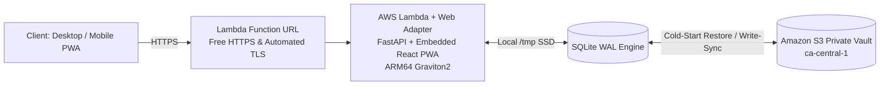

# Folio

Folio is a self-hosted personal finance tracking, statement ingestion, and household budgeting application. Built with FastAPI, SQLite (WAL mode), and a React 19 + Vite + Tailwind CSS PWA, designed for high performance on desktop and mobile, with optional zero-cost AWS SAM serverless deployment in `ca-central-1`.

Designed for high-density desktop statement parsing and data entry with responsive mobile consultation (charts, budget meters, net worth progression).

---

## Features

- **Multi-Format Statement Ingestion**:
  - **CSV & Bank Formats**: Auto-detects delimiters and column headers across major Canadian (RBC, TD, BMO, Scotiabank, Desjardins, CIBC) and US/Global banks (`CAD$`, `USD$`, `Debit`, `Credit`, `Description 1`, `Description 2`).
  - **PDF Statements**: Extracts tabular transactions and text patterns from Chase, Amex, Bank of America, and credit unions via `pdfplumber`.
  - **OFX / QFX / QBO**: Ingests direct bank export formats via `ofxtools`.
  - **Currency**: New accounts and transactions default to **CAD** (override with
    `FOLIO_DEFAULT_CURRENCY`). Where a statement states its own currency -- an OFX
    `CURDEF`, or an RBC `CAD$`/`USD$` column -- the statement wins over the default.
- **Zero-Duplicate Import Engine**: Deterministic SHA-256 fingerprinting per transaction (`account_id` + `date` + `amount` + `payee`) flags and filters out duplicate rows across overlapping statement imports.
- **Intelligent Multi-Tier Categorization & Auto-Learning**:
  - **Tier 1 (Priority Seed Rules)**: 100+ North American, Canadian, and subscription merchants seeded out of the box (Suno AI, Tidal, A30 Express, 407 ETR, Hydro-Québec, Jean Coutu, Privamed, Boustan, A&W, SAQ, LCBO, Steam, PSN, TradingView, etc.).
  - **Tier 2 (Semantic Keyword Classifier)**: Offline commercial domain taxonomy (tolls, parking, transit, clinics, dental, pharmacies, cafes, bakeries, utilities, SaaS) automatically classifies unseeded merchants.
  - **Tier 3 (Adaptive Auto-Learning)**: Automatically remembers your category assignments from the Ledger or Import Workspace and creates active rules so you never have to recategorize that merchant.
  - **Bilingual Normalizer**: Strips English and French bank transaction noise (`PRÉLÈVEMENT`, `PAIEMENT DIRECT / FACTURE`, `VIREMENT INTERAC`, `ACH DEBIT`, `POS DEBIT`, postal codes, and terminal IDs).
- **Loan & Mortgage Intelligence**:
  - Full month-by-month loan amortization schedules for 15/30-year Mortgages and Vehicle Loans.
  - Computes remaining interest, payoff date projections, and automated Principal vs. Interest vs. Escrow payment splits.
- **Cash Flow Analysis**:
  - Transfers between your own accounts (credit-card payments, savings transfers) are
    identified and excluded from income and expenses, then reported separately as
    transfer volume -- so paying a credit card no longer inflates both sides of the
    monthly summary.
  - Interactive Sankey Flow Chart visualizing cash flow from Income into Category
    expenditures and Net Savings, with the remainder rolled into an "Other" bucket so
    the flows sum to the totals above them.
- **Investment Performance**:
  - Holdings, purchase lots, and cost basis per security, with fractional-share support.
  - **Time-weighted return (TWR)** — how the investments performed, independent of when
    you deposited — alongside **money-weighted return (XIRR)** — what you actually earned,
    including your timing. Reported for 1M / 3M / YTD / 1Y / all-time.
  - Contributions-versus-market-growth breakdown: how much of the balance you saved and
    how much the market added.
  - Prices are entered manually (pasted in bulk); Folio makes no outbound market-data
    calls, preserving the offline, zero-cost posture. Positions with no recorded price are
    labelled rather than silently valued at cost.
- **Envelope Budgeting & Analytics**:
  - Category target progress meters with live spend tracking and overspend warnings.
  - **Real net worth history** from recorded daily balance snapshots, reconstructible for
    existing installations by replaying transactions backwards.
- **Exact Money Arithmetic**: All amounts are stored as integer minor units (cents), so
  balances, budget actuals, and amortization cannot accumulate floating-point drift. The
  HTTP API continues to speak dollars.
- **Canadian Mortgage Mathematics**: Fixed-rate mortgages amortize with semi-annual
  compounding, not in advance (Interest Act, s.6), rather than the US monthly convention.
  Accounts can be switched to `MONTHLY` for US loans.
- **Zero-Cost Serverless Cloud Architecture**:
  - AWS SAM model with Lambda Web Adapter and Function URL ($0.00/month baseline within AWS Free Tier).
  - Automatic S3 SQLite cold-start restore and write-snapshot synchronization.
  - Installable PWA with service worker caching for offline balance consultation on iOS and Android.

---

## Architecture

Folio uses a unified deployment model. The React PWA is compiled in a multi-stage build and served directly by FastAPI on port 8000, eliminating CORS issues and secondary CDN hosting requirements.



---

## Quick Start (Local Development)

### 1. Prerequisites
- Python 3.13+ (CI tests on 3.13; the container image ships 3.14)
- Node.js 22.12+ or 20.19+ (CI and the container image both build on 24; this is
  Vite 8's floor) and npm

### 2. 1-Command Local Development
Launch both the FastAPI backend and Vite frontend with live hot-reloading:

```powershell
.\dev.ps1
```

This automatically initializes the virtual environment, installs requirements, launches the backend on `http://localhost:8000`, the frontend on `http://localhost:5173`, and opens your browser.

#### First Run: Setting a Master Passphrase

There is no default password. Authentication is fail-closed, so with nothing
configured the app starts normally and then rejects every API call.

On first run `dev.ps1` prompts for a master passphrase, bcrypt-hashes it locally,
and writes only the hash to `backend/.env`, which is gitignored. Subsequent runs
pick it up automatically.

```powershell
.\dev.ps1 -SetPassword   # change the passphrase
```

`-Clean` wipes the database and uploads but leaves the passphrase alone: it is
configuration, not data.

To generate a hash yourself -- for `docker-compose`, or to set
`FOLIO_MASTER_PASSWORD_HASH` by hand -- the helper reads the passphrase from
stdin so it never reaches your shell history:

```powershell
python backend\scripts\hash_password.py
```

#### Database Migrations

The schema is managed by Alembic and upgraded automatically on startup, so a fresh
database is created on first boot with no manual step. The current schema is a single
initial revision -- there was no deployed database to migrate from when Alembic was
introduced, so there is no upgrade history to replay.

```powershell
cd backend
.\.venv\Scripts\python.exe -m alembic current      # show the applied revision
.\.venv\Scripts\python.exe -m alembic upgrade head # apply pending revisions
```

#### Backfilling Existing Installations

Two one-shot operations reconstruct data that older versions never recorded:

```
POST /api/maintenance/backfill-snapshots?months=24   # real net worth history
POST /api/maintenance/detect-transfers               # pair historical transfers
```

Run both once after upgrading. Until the first runs, the net worth chart has no history
to draw; until the second runs, historical credit-card payments still read as cash flow.

#### Resetting / Reinitializing Database
To wipe and reinitialize the SQLite database and all uploaded files to a clean state:
```powershell
.\dev.ps1 -Clean
```

---

## Running Automated Tests

Run the complete 3-phase automated test suite (backend Pytest suite + frontend Vitest suite with `happy-dom` + TypeScript typecheck & production build verification) in 1 command:

```powershell
.\test.ps1
```

---

## CI/CD & Automated Security

Folio includes automated GitHub Actions workflows:

- **Continuous Integration ([`.github/workflows/ci.yml`](.github/workflows/ci.yml))**: Runs the Pytest suite, the Vitest suite, a TypeScript project build (`tsc -b`), and the Vite production bundle on every commit.
- **CodeQL Security Analysis ([`.github/workflows/codeql.yml`](.github/workflows/codeql.yml))**: Performs static application security testing (SAST) for Python and TypeScript on push and weekly schedule.
- **Gitleaks Secret Scanner ([`.github/workflows/secret-scan.yml`](.github/workflows/secret-scan.yml))**: Scans commits for exposed secrets, tokens, or credentials.
- **Dependabot ([`.github/dependabot.yml`](.github/dependabot.yml))**: Automated weekly grouped updates for `pip`, `npm`, and GitHub Actions.

---

## Docker Compose Setup

Run the unified single-container build (FastAPI + embedded PWA + SQLite):

```powershell
docker compose up --build
```

Access the application at `http://localhost:8000`.

---

## Security & Zero-Trust Architecture

Folio implements an enterprise-grade defense-in-depth security model engineered for hosting personal financial data on the public internet:

- **Dual-Auth Identity Engine**:
  - **AWS Cognito User Pool (Cloud / Production)**: Zero-Trust OpenID Connect / JWKS cryptographic token validation, Admin-only user provisioning (`AllowAdminCreateUserOnly: true`), robust password policies, and optional **TOTP Software Token MFA** (Google Authenticator, 1Password, Apple Keychain) with 50,000 free monthly active users.
  - **Master Passphrase Vault (Local / Docker)**: Protected by bcrypt hashing, constant-time comparisons (`secrets.compare_digest`), and signed `HttpOnly`, `SameSite=Lax`, `Secure` JWT session cookies. In production only the **hashed** form (`FOLIO_MASTER_PASSWORD_HASH`) is accepted -- `deploy.ps1` hashes the passphrase locally so it never reaches CloudFormation or the Lambda environment.
- **Fail-Fast Production Configuration**: The application refuses to start in production with the built-in development signing key or a plaintext master password.
- **Login Rate Limiting**: Failed sign-in attempts are throttled per client with a sliding window, bounding online guessing against the single master passphrase.
- **Bounded User-Supplied Regex**: Categorization rules accepting regular expressions are length-limited and screened for nested quantifiers, so a rule cannot cause catastrophic backtracking.
- **Fail-Closed Access Control**: Unconfigured or invalid sessions are strictly rejected (`HTTP 401 Unauthorized`); no unauthenticated routes bypass financial endpoints.
- **Edge Perimeter Protection**: Lambda Function URL is protected with origin secret verification (`X-Folio-Origin-Verify`) to ensure traffic flows through CloudFront CDN / AWS WAF, mitigating single-concurrency exhaustion (DoS) attacks.
- **Modern Defense-in-Depth HTTP Headers**: Full injection of `Content-Security-Policy` (CSP), `X-Frame-Options: DENY`, `X-Content-Type-Options: nosniff`, and `Permissions-Policy`.
- **Directory Traversal & Ingestion Safeguards**: Strict filesystem boundary containment checks for static SPA routing and 25 MB max upload limits with magic-byte format verification for PDF and statement files.
- **Transactional S3 Vault Encryption**: Private S3 database snapshots are uploaded with Server-Side Encryption (`AES256`). Snapshots are debounced so a burst of edits coalesces into a single upload instead of pushing the whole database on every write; imports and shutdown force an immediate snapshot.
- **Container Non-Root Isolation**: Multi-stage Docker execution runs as a dedicated unprivileged `appuser` (UID 1000).

---

## AWS SAM Serverless Deployment (True $0.00/mo Baseline)

Folio includes a native AWS SAM model (`template.yaml` + `Dockerfile`) utilizing the **AWS Lambda Web Adapter** on ARM64 Graviton2 with direct **Lambda Function URLs** and Cognito User Pools:

### 1-Command SAM Deployment
```powershell
.\deploy.ps1 -Region ca-central-1 -StackName folio-prod
```

Pass `-MasterPassword` (a `SecureString`) to configure fallback vault authentication; the
passphrase is bcrypt-hashed locally and only the hash is sent to CloudFormation. Pass
`-AllowedOrigin https://folio.example.com` only if you front the function with a custom
domain -- the PWA is served by the function itself, so cross-origin access is not needed
by default.

### How the SAM Architecture Works:
1. **Lambda Web Adapter**: Runs the standard FastAPI app and compiled React 19 PWA directly inside AWS Lambda without code modifications.
2. **Lambda Function URL**: Provides a direct HTTPS endpoint with automated TLS and free CORS (bypassing API Gateway fees).
3. **AWS Cognito User Pool**: Manages owner identity, credentials, and TOTP MFA tokens out of the box.
4. **Single-Writer SQLite Locking**: Configured with `ReservedConcurrentExecutions: 1` to guarantee database file consistency.
5. **Automated S3 Sync**: Restores `folio.db` on cold-start and checkpoints debounced snapshots back to the private S3 vault, forcing an immediate upload after imports and at shutdown.
6. **Writable Paths**: Both the database (`/tmp/folio.db`) and statement uploads (`/tmp/uploads`) live under `/tmp`, the only writable location in Lambda.
7. **Cost**: **$0.00/month** (100% within the AWS Lambda Always-Free Tier of 1M requests/month + Cognito 50,000 free MAUs).

---

## License & Rights

All rights reserved (c) Michael Sanford.


## Security scanning

[Snyk](https://snyk.io) runs on every push and pull request, and weekly on a schedule,
via [`.github/workflows/snyk.yml`](.github/workflows/snyk.yml):

- **Snyk Open Source** — known vulnerabilities in resolved dependencies
- **Snyk Code** — static analysis of first-party source

Findings are published to this repository's **Security → Code scanning** tab. The build
fails on anything at `high` severity or above.

Pushes to the default branch also snapshot the dependency tree to snyk.io, so a
CVE disclosed later raises an alert without anything here changing.

Run the same scans locally before pushing:

```powershell
./scripts/Invoke-SnykScan.ps1                          # exactly what CI runs
./scripts/Invoke-SnykScan.ps1 -SeverityThreshold low   # everything, including noise
```

Requires the Snyk CLI (`winget install Snyk.Snyk`) and a one-time `snyk auth`.
