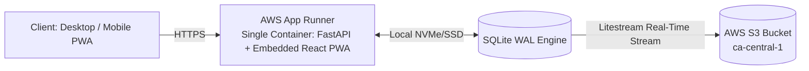

# Folio

Folio is a self-hosted personal finance tracking, statement ingestion, and household budgeting application. Built with FastAPI, SQLite (WAL mode), Litestream (continuous S3 replication), and a React 19 + Vite + Tailwind CSS PWA.

Designed for high-density desktop statement parsing and data entry with responsive mobile consultation (charts, budget meters, net worth progression).

---

## Features

- **Multi-Format Statement Ingestion**:
  - **CSV**: Auto-detects delimiters and column headers (Date, Payee, Amount, Debit/Credit, Memo).
  - **PDF Statements**: Extracts tabular transactions and text patterns from Chase, Amex, Bank of America, and credit unions via `pdfplumber`.
  - **OFX / QFX / QBO**: Ingests direct bank export formats via `ofxtools`.
- **Zero-Duplicate Import Engine**: Deterministic SHA-256 fingerprinting per transaction (`account_id` + `date` + `amount` + `payee`) flags and filters out duplicate rows across overlapping statement imports.
- **Auto-Categorization & Merchant Normalization**:
  - Cleans raw bank payee descriptions (e.g. `POS DEBIT CHASE *SQ BLUE BOTTLE #12` -> `Blue Bottle Coffee`).
  - Evaluates configurable priority rules (`CONTAINS`, `EXACT`, `STARTS_WITH`, `REGEX`) with interactive sandbox testing.
  - Automatically identifies inter-account transfers (Checking <-> Credit Card / Loans) within rolling time windows.
- **Loan & Mortgage Intelligence**:
  - Full month-by-month loan amortization schedules for 15/30-year Mortgages and Vehicle Loans.
  - Computes remaining interest, payoff date projections, and automated Principal vs. Interest vs. Escrow payment splits.
- **Envelope Budgeting & Analytics**:
  - Category target progress meters with live spend tracking and overspend warnings.
  - Interactive Sankey Flow Chart visualizing cash flow from Income into Category expenditures and Net Savings.
  - 6-Month Net Worth timeline (Assets vs. Liabilities).
- **Resilient Cloud & Disaster Recovery**:
  - SQLite in WAL mode with Litestream continuously streaming SQLite WAL transactions to AWS S3 in real-time.
  - Installable PWA with service worker caching for offline balance consultation on iOS and Android.

---

## Architecture

Folio uses a unified single-container deployment model. The React PWA is compiled in a multi-stage Docker build and served directly by FastAPI on port 8000, eliminating CORS issues and secondary CDN hosting requirements.



---

## Quick Start (Local Development)

### 1. Prerequisites
- Python 3.13+
- Node.js 23+ and npm (or Node 22 LTS)

### 2. 1-Command Local Development
Launch both the FastAPI backend and Vite frontend with live hot-reloading:

**Windows (PowerShell):**
```powershell
.\dev.ps1
```

**macOS / Linux (Bash):**
```bash
./dev.sh
```

This automatically initializes the environment, launches the backend on `http://localhost:8000`, the frontend on `http://localhost:5173`, and opens your browser.

---

## Running Automated Tests

Run the complete test suite (backend Pytest coverage + frontend TypeScript build check) in 1 command:

**Windows (PowerShell):**
```powershell
.\test.ps1
```

**macOS / Linux (Bash):**
```bash
./test.sh
```

---

## Docker Compose Setup

Run the unified single-container build (FastAPI + embedded PWA + SQLite + Litestream):

```bash
docker compose -f infra/docker-compose.yml up --build
```

Access the application at `http://localhost:8000`.

---

## PyCharm / JetBrains IDE Setup

Pre-configured run configurations are included in `.idea/runConfigurations/`:
- **Full Stack (Backend + Frontend)**: Launches both the FastAPI server and Vite dev server concurrently.
- **FastAPI Backend**: Runs `uvicorn app.main:app --reload --port 8000` with hot-reload.
- **Vite Frontend (Dev)**: Runs `npm run dev`.
- **Pytest (Backend)**: Runs the Pytest test suite with graphical test tree.
- **Deploy to AWS (SAM Serverless)**: Deploys the serverless stack using AWS SAM.
- **docker-compose up**: Starts the unified container locally.

---

## Security & Authentication

Folio features multi-layered security designed for public cloud deployment:

- **Master Passphrase Vault Lock**: Protected by bcrypt password hashing and signed `HttpOnly`, `SameSite=Strict`, `Secure` JWT session tokens.
- **Protected Endpoints**: All financial data routes require authenticated sessions.
- **Security Headers**: Automatic injection of `X-Content-Type-Options: nosniff`, `X-Frame-Options: DENY`, `X-XSS-Protection`, and `Referrer-Policy`.
- **WAF & Edge Protection**: Compatible with Cloudflare Free Tier (DDoS, WAF, and Zero Trust Access) or AWS WAF on CloudFront.

---

## AWS SAM Serverless Deployment (True $0.00/mo Baseline)

Folio includes a native AWS SAM model (`template.yaml` + `Dockerfile.sam`) utilizing the **AWS Lambda Web Adapter** on ARM64 Graviton2 with direct **Lambda Function URLs**:

### 1-Command SAM Deployment (PowerShell / Windows)
```powershell
.\infra\sam-deploy.ps1 -Region ca-central-1 -StackName folio-sam-prod
```

### 1-Command SAM Deployment (Bash / Linux / macOS)
```bash
./infra/sam-deploy.sh ca-central-1 folio-sam-prod
```

### How the SAM Architecture Works:
1. **Lambda Web Adapter**: Runs the standard FastAPI app and compiled React 19 PWA directly inside AWS Lambda without code modifications.
2. **Lambda Function URL**: Provides a direct public HTTPS endpoint with automated TLS and free CORS (bypassing API Gateway fees).
3. **Single-Writer SQLite Locking**: Configured with `ReservedConcurrentExecutions: 1` to guarantee database file consistency.
4. **Automated S3 Sync**: Pulls `folio.db` on cold-start and checkpoints snapshots back to the private S3 vault.
5. **Cost**: **$0.00/month** (100% within the AWS Lambda Always-Free Tier of 1M requests/month).

---

## Alternative: AWS App Runner CloudFormation Deployment

If you prefer a 24/7 warm container with continuous Litestream WAL background streaming (~$3.50/mo):

```powershell
.\infra\deploy.ps1 -Region ca-central-1 -StackName folio-prod
```

---

## License & Rights

All rights reserved (c) Michael Sanford.
