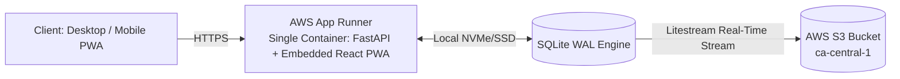

# Folio

Folio is a self-hosted personal finance tracking, statement ingestion, and household budgeting application. Built with FastAPI, SQLite (WAL mode), Litestream (continuous S3 replication), and a React 19 + Vite + Tailwind CSS PWA.

Designed for high-density desktop statement parsing and data entry with responsive mobile consultation (charts, budget meters, net worth progression).

---

## Features

- **Multi-Format Statement Ingestion**:
  - **CSV**: Auto-detects delimiters and column headers (Date, Payee, Amount, Debit/Credit, Memo).
  - **PDF Statements**: Extracts tabular transactions and text patterns from Chase, Amex, Bank of America, and credit unions via `pdfplumber`.
  - **OFX / QFX / QBO**: Ingests direct bank export formats via `ofxtools`.
- **Zero-Duplicate Import Engine**: Deterministic SHA-256 fingerprinting per transaction (`account_id` + `date` + `amount` + `payee`) flags and filters out duplicate rows across overlapping statement imports.
- **Auto-Categorization & Merchant Normalization**:
  - Cleans raw bank payee descriptions (e.g. `POS DEBIT CHASE *SQ BLUE BOTTLE #12` -> `Blue Bottle Coffee`).
  - Evaluates configurable priority rules (`CONTAINS`, `EXACT`, `STARTS_WITH`, `REGEX`) with interactive sandbox testing.
  - Automatically identifies inter-account transfers (Checking <-> Credit Card / Loans) within rolling time windows.
- **Loan & Mortgage Intelligence**:
  - Full month-by-month loan amortization schedules for 15/30-year Mortgages and Vehicle Loans.
  - Computes remaining interest, payoff date projections, and automated Principal vs. Interest vs. Escrow payment splits.
- **Envelope Budgeting & Analytics**:
  - Category target progress meters with live spend tracking and overspend warnings.
  - Interactive Sankey Flow Chart visualizing cash flow from Income into Category expenditures and Net Savings.
  - 6-Month Net Worth timeline (Assets vs. Liabilities).
- **Resilient Cloud & Disaster Recovery**:
  - SQLite in WAL mode with Litestream continuously streaming SQLite WAL transactions to AWS S3 in real-time.
  - Installable PWA with service worker caching for offline balance consultation on iOS and Android.

---

## Architecture

Folio uses a unified single-container deployment model. The React PWA is compiled in a multi-stage Docker build and served directly by FastAPI on port 8000, eliminating CORS issues and secondary CDN hosting requirements.



---

## Quick Start (Local Development)

### 1. Prerequisites
- Python 3.13+
- Node.js 23+ and npm (or Node 22 LTS)

### 2. Backend Setup
```bash
cd backend
python -m venv .venv
.\.venv\Scripts\Activate.ps1
pip install -r requirements.txt
uvicorn app.main:app --reload --port 8000
```

The API docs will be available at:
- Interactive Swagger UI: `http://localhost:8000/api/docs`
- ReDoc: `http://localhost:8000/api/redoc`

### 3. Frontend Setup
```bash
cd frontend
npm install
npm run dev
```

Open `http://localhost:5173` in your browser.

---

## Docker Compose Setup

Run the unified single-container build (FastAPI + embedded PWA + SQLite + Litestream):

```bash
docker compose -f infra/docker-compose.yml up --build
```

Access the application at `http://localhost:8000`.

---

## PyCharm / JetBrains IDE Setup

Pre-configured run configurations are included in `.idea/runConfigurations/`:
- **docker-compose up**: Starts the unified stack inside Docker with `--build`.
- **Full Stack (Backend + Frontend)**: Launches both the FastAPI server and Vite dev server concurrently.
- **FastAPI Backend**: Runs `uvicorn app.main:app --reload --port 8000` with hot-reload.
- **Vite Frontend (Dev)**: Runs `npm run dev`.
- **Pytest (Backend)**: Runs the Pytest test suite with graphical test tree.

---

## Running Automated Tests

Run the Pytest suite (covering ingestion, loan math, rule matching, and budgeting):

```bash
cd backend
pytest
```

---

## AWS Deployment (App Runner + S3)

To deploy Folio to AWS with minimal moving parts:

1. **Create an S3 Bucket**: Create a private S3 bucket in `ca-central-1` (e.g. `folio-storage-vault`).
2. **Build and Push Container Image**:
   ```bash
   docker build -t folio:latest .
   ```
3. **Deploy to AWS App Runner**:
   - Point App Runner to your container image in Amazon ECR.
   - Set environment variables in the App Runner configuration:
     ```env
     SQLITE_DB_PATH=/app/data/folio.db
     S3_BUCKET_NAME=folio-storage-vault
     AWS_DEFAULT_REGION=ca-central-1
     AWS_ACCESS_KEY_ID=your-key-id
     AWS_SECRET_ACCESS_KEY=your-secret-key
     ```
   - Port: `8000`
   - App Runner automatically manages HTTPS certificates, custom domains, and scales CPU to zero during idle periods.

---

## License & Rights

All rights reserved (c) Michael Sanford.
