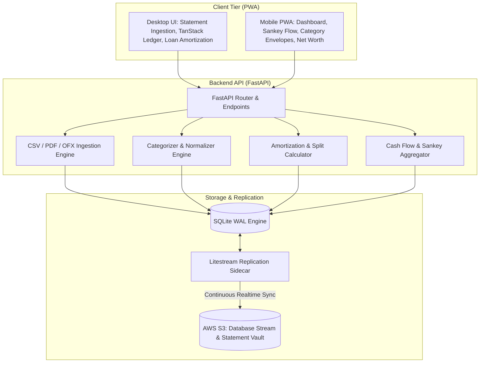

# Folio 📊

**Folio** is a self-hosted personal finance tracking, statement ingestion, and household budgeting application. Built with **FastAPI**, **SQLite (WAL mode)**, **Litestream (continuous S3 replication)**, and a high-performance **React 19 + Vite + Tailwind CSS + TanStack Table PWA**.

Designed for high-density desktop statement parsing and data entry with responsive mobile consultation (charts, budget meters, net worth progression).

---

## ✨ Features

- 📑 **Multi-Format Statement Ingestion**:
  - **CSV**: Auto-detects delimiters and column headers (Date, Payee, Amount, Debit/Credit, Memo).
  - **PDF Statements**: Extracts tabular transactions and text patterns from Chase, Amex, Bank of America, and credit unions via `pdfplumber`.
  - **OFX / QFX / QBO**: Ingests direct bank export formats via `ofxtools`.
- 🛡️ **Zero-Duplicate Import Engine**: Deterministic SHA-256 fingerprinting per transaction (`account_id` + `date` + `amount` + `payee`) flags and filters out duplicate rows across overlapping statement imports.
- ⚡ **Auto-Categorization & Merchant Normalization**:
  - Cleans messy raw bank payee descriptions (e.g. `POS DEBIT CHASE *SQ BLUE BOTTLE #12` $\to$ `Blue Bottle Coffee`).
  - Evaluates configurable priority rules (`CONTAINS`, `EXACT`, `STARTS_WITH`, `REGEX`) with interactive sandbox testing.
  - Automatically identifies inter-account transfers (Checking $\leftrightarrow$ Credit Card / Loans) within rolling time windows.
- 🏠 **Loan & Mortgage Intelligence**:
  - Full month-by-month loan amortization schedules for 15/30-year Mortgages and Vehicle Loans.
  - Computes remaining interest, payoff date projections, and automated Principal vs. Interest vs. Escrow payment splits.
- 💵 **Envelope Budgeting & Analytics**:
  - Category target progress meters with live spend tracking and overspend warnings.
  - Interactive **Sankey Flow Chart** visualizing cash flow from Income into Category expenditures and Net Savings.
  - 6-Month Net Worth timeline (Assets vs. Liabilities).
- ☁️ **Resilient Cloud & Disaster Recovery**:
  - SQLite in WAL mode with **Litestream** continuously streaming SQLite WAL transactions to AWS S3 in real-time.
  - Encrypted statement vault for original CSV/PDF statement files.
  - Installable **PWA** with service worker caching for offline balance consultation on iOS and Android.

---

## 🏗️ Architecture



---

## 🚀 Quick Start (Local Development)

### 1. Prerequisites
- **Python 3.12+**
- **Node.js 20+** and **npm**

### 2. Backend Setup
```bash
# Navigate to backend and create virtual environment
cd backend
python -m venv venv

# Activate venv (Windows PowerShell)
.\venv\Scripts\Activate.ps1
# (macOS/Linux: source venv/bin/activate)

# Install dependencies
pip install -r requirements.txt

# Run FastAPI backend server
uvicorn app.main:app --reload --port 8000
```

The API docs will be available at:
- **Interactive Swagger UI**: `http://localhost:8000/api/docs`
- **ReDoc**: `http://localhost:8000/api/redoc`

### 3. Frontend Setup
```bash
# Navigate to frontend and start Vite dev server
cd frontend
npm install
npm run dev
```

Open `http://localhost:5173` in your browser.

---

## 🐳 Docker Compose Setup

Run the full stack (FastAPI + Vite + SQLite + Litestream) with a single command:

```bash
docker compose -f infra/docker-compose.yml up --build
```

---

## 🧪 Running Automated Tests

Run the Pytest suite (covering ingestion, loan math, rule matching, and budgeting):

```bash
cd backend
.\venv\Scripts\pytest.exe
```

---

## ☁️ AWS Litestream S3 Setup

To enable real-time database replication to AWS S3:

1. Create a private S3 bucket (e.g. `folio-storage-vault`).
2. Set your environment variables in `.env` or AWS ECS/AppRunner task definition:
   ```env
   S3_BUCKET_NAME=folio-storage-vault
   AWS_DEFAULT_REGION=us-east-1
   AWS_ACCESS_KEY_ID=your-key-id
   AWS_SECRET_ACCESS_KEY=your-secret-key
   ```
3. Run Litestream replication:
   ```bash
   litestream replicate -config litestream.yml
   ```

---

## 📄 License & Rights

All rights reserved © Michael Sanford.
