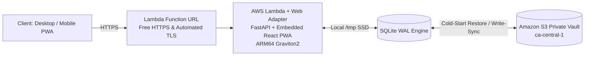

# Folio

Folio is a self-hosted personal finance tracking, statement ingestion, and household budgeting application. Built with FastAPI, SQLite (WAL mode), and a React 19 + Vite + Tailwind CSS PWA, designed for high performance on desktop and mobile, with optional zero-cost AWS SAM serverless deployment in `ca-central-1`.

Designed for high-density desktop statement parsing and data entry with responsive mobile consultation (charts, budget meters, net worth progression).

---

## Features

- **Multi-Format Statement Ingestion**:
  - **CSV & Bank Formats**: Auto-detects delimiters and column headers across major Canadian (RBC, TD, BMO, Scotiabank, Desjardins, CIBC) and US/Global banks (`CAD$`, `USD$`, `Debit`, `Credit`, `Description 1`, `Description 2`).
  - **PDF Statements**: Extracts tabular transactions and text patterns from Chase, Amex, Bank of America, and credit unions via `pdfplumber`.
  - **OFX / QFX / QBO**: Ingests direct bank export formats via `ofxtools`.
- **Zero-Duplicate Import Engine**: Deterministic SHA-256 fingerprinting per transaction (`account_id` + `date` + `amount` + `payee`) flags and filters out duplicate rows across overlapping statement imports.
- **Intelligent Multi-Tier Categorization & Auto-Learning**:
  - **Tier 1 (Priority Seed Rules)**: 100+ North American, Canadian, and subscription merchants seeded out of the box (Suno AI, Tidal, A30 Express, 407 ETR, Hydro-Québec, Jean Coutu, Privamed, Boustan, A&W, SAQ, LCBO, Steam, PSN, TradingView, etc.).
  - **Tier 2 (Semantic Keyword Classifier)**: Offline commercial domain taxonomy (tolls, parking, transit, clinics, dental, pharmacies, cafes, bakeries, utilities, SaaS) automatically classifies unseeded merchants.
  - **Tier 3 (Adaptive Auto-Learning)**: Automatically remembers your category assignments from the Ledger or Import Workspace and creates active rules so you never have to recategorize that merchant.
  - **Bilingual Normalizer**: Strips English and French bank transaction noise (`PRÉLÈVEMENT`, `PAIEMENT DIRECT / FACTURE`, `VIREMENT INTERAC`, `ACH DEBIT`, `POS DEBIT`, postal codes, and terminal IDs).
- **Loan & Mortgage Intelligence**:
  - Full month-by-month loan amortization schedules for 15/30-year Mortgages and Vehicle Loans.
  - Computes remaining interest, payoff date projections, and automated Principal vs. Interest vs. Escrow payment splits.
- **Envelope Budgeting & Analytics**:
  - Category target progress meters with live spend tracking and overspend warnings.
  - Interactive Sankey Flow Chart visualizing cash flow from Income into Category expenditures and Net Savings.
  - 6-Month Net Worth timeline (Assets vs. Liabilities).
- **Zero-Cost Serverless Cloud Architecture**:
  - AWS SAM model with Lambda Web Adapter and Function URL ($0.00/month baseline within AWS Free Tier).
  - Automatic S3 SQLite cold-start restore and write-snapshot synchronization.
  - Installable PWA with service worker caching for offline balance consultation on iOS and Android.

---

## Architecture

Folio uses a unified deployment model. The React PWA is compiled in a multi-stage build and served directly by FastAPI on port 8000, eliminating CORS issues and secondary CDN hosting requirements.



---

## Quick Start (Local Development)

### 1. Prerequisites
- Python 3.12+ (tested up to 3.14)
- Node.js 20+ (tested with Node 22/23 LTS) and npm

### 2. 1-Command Local Development
Launch both the FastAPI backend and Vite frontend with live hot-reloading:

```powershell
.\dev.ps1
```

This automatically initializes the virtual environment, installs requirements, launches the backend on `http://localhost:8000`, the frontend on `http://localhost:5173`, and opens your browser.

#### Resetting / Reinitializing Database
To wipe and reinitialize the SQLite database and all uploaded files to a clean state:
```powershell
.\dev.ps1 -Clean
```

---

## Running Automated Tests

Run the complete 3-phase automated test suite (backend Pytest suite + frontend Vitest suite with `happy-dom` + TypeScript typecheck & production build verification) in 1 command:

```powershell
.\test.ps1
```

---

## CI/CD & Automated Security

Folio includes automated GitHub Actions workflows:

- **Continuous Integration ([`.github/workflows/ci.yml`](.github/workflows/ci.yml))**: Runs all 38 Pytest tests, 5 Vitest tests, and Vite production bundle on every commit.
- **CodeQL Security Analysis ([`.github/workflows/codeql.yml`](.github/workflows/codeql.yml))**: Performs static application security testing (SAST) for Python and TypeScript on push and weekly schedule.
- **Gitleaks Secret Scanner ([`.github/workflows/secret-scan.yml`](.github/workflows/secret-scan.yml))**: Scans commits for exposed secrets, tokens, or credentials.
- **Dependabot ([`.github/dependabot.yml`](.github/dependabot.yml))**: Automated weekly grouped updates for `pip`, `npm`, and GitHub Actions.

---

## Docker Compose Setup

Run the unified single-container build (FastAPI + embedded PWA + SQLite):

```powershell
docker compose up --build
```

Access the application at `http://localhost:8000`.

---

## Security & Zero-Trust Architecture

Folio implements an enterprise-grade defense-in-depth security model engineered for hosting personal financial data on the public internet:

- **Dual-Auth Identity Engine**:
  - **AWS Cognito User Pool (Cloud / Production)**: Zero-Trust OpenID Connect / JWKS cryptographic token validation, Admin-only user provisioning (`AllowAdminCreateUserOnly: true`), robust password policies, and optional **TOTP Software Token MFA** (Google Authenticator, 1Password, Apple Keychain) with 50,000 free monthly active users.
  - **Master Passphrase Vault (Local / Docker)**: Protected by bcrypt hashing, constant-time comparisons (`secrets.compare_digest`), and signed `HttpOnly`, `SameSite=Strict`, `Secure` JWT session cookies.
- **Fail-Closed Access Control**: Unconfigured or invalid sessions are strictly rejected (`HTTP 401 Unauthorized`); no unauthenticated routes bypass financial endpoints.
- **Edge Perimeter Protection**: Lambda Function URL is protected with origin secret verification (`X-Folio-Origin-Verify`) to ensure traffic flows through CloudFront CDN / AWS WAF, mitigating single-concurrency exhaustion (DoS) attacks.
- **Modern Defense-in-Depth HTTP Headers**: Full injection of `Content-Security-Policy` (CSP), `X-Frame-Options: DENY`, `X-Content-Type-Options: nosniff`, and `Permissions-Policy`.
- **Directory Traversal & Ingestion Safeguards**: Strict filesystem boundary containment checks for static SPA routing and 25 MB max upload limits with magic-byte format verification for PDF and statement files.
- **Transactional S3 Vault Encryption**: Private S3 database snapshots are uploaded with Server-Side Encryption (`AES256`/`KMS`) and write-through checkpoint synchronization after every batch commit or balance change.
- **Container Non-Root Isolation**: Multi-stage Docker execution runs as a dedicated unprivileged `appuser` (UID 1000).

---

## AWS SAM Serverless Deployment (True $0.00/mo Baseline)

Folio includes a native AWS SAM model (`template.yaml` + `Dockerfile`) utilizing the **AWS Lambda Web Adapter** on ARM64 Graviton2 with direct **Lambda Function URLs** and Cognito User Pools:

### 1-Command SAM Deployment
```powershell
.\deploy.ps1 -Region ca-central-1 -StackName folio-prod
```

### How the SAM Architecture Works:
1. **Lambda Web Adapter**: Runs the standard FastAPI app and compiled React 19 PWA directly inside AWS Lambda without code modifications.
2. **Lambda Function URL**: Provides a direct HTTPS endpoint with automated TLS and free CORS (bypassing API Gateway fees).
3. **AWS Cognito User Pool**: Manages owner identity, credentials, and TOTP MFA tokens out of the box.
4. **Single-Writer SQLite Locking**: Configured with `ReservedConcurrentExecutions: 1` to guarantee database file consistency.
5. **Automated S3 Write-Through Sync**: Restores `folio.db` on cold-start and checkpoints snapshots back to the private S3 vault upon every batch commit and ledger mutation.
6. **Cost**: **$0.00/month** (100% within the AWS Lambda Always-Free Tier of 1M requests/month + Cognito 50,000 free MAUs).

---

## License & Rights

All rights reserved (c) Michael Sanford.

