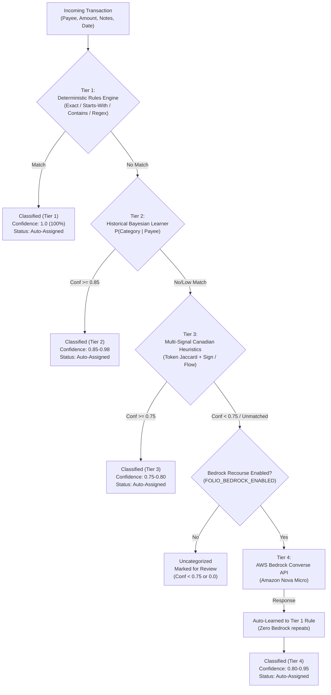
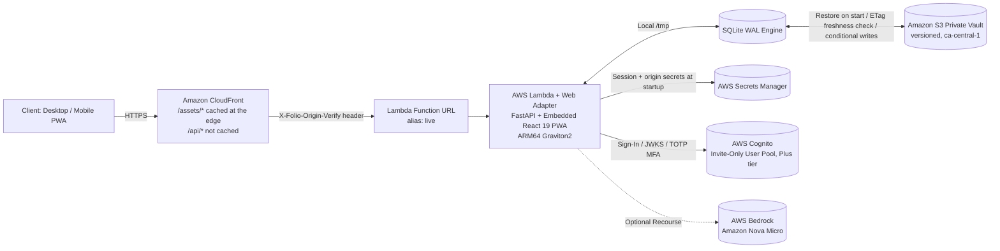

<p></p>

# Folio

Folio is a self-hosted personal finance tracking, statement ingestion, and household budgeting application. Built with **FastAPI**, **SQLite (WAL mode)**, and a **React 19 + Vite + Tailwind CSS PWA**, it is engineered for high performance on desktop and mobile, with an optional low-cost AWS SAM serverless deployment (CloudFront + Lambda + S3) in `ca-central-1`.

Folio combines high-density desktop statement parsing and data entry with responsive mobile consultation (charts, budget meters, net worth progression), tailored for Canadian and North American households.

---

## Table of Contents

- [Core Capabilities](#core-capabilities)
  - [1. Multi-Tier Auto-Classification Engine](#1-multi-tier-auto-classification-engine)
  - [2. Canadian Personal Finance & Household Collaboration](#2-canadian-personal-finance--household-collaboration)
  - [3. Dedicated Goals & CRA Contribution Tracking](#3-dedicated-goals--cra-contribution-tracking)
  - [4. Envelope Budgeting & Cash Flow Trajectory Forecasting](#4-envelope-budgeting--cash-flow-trajectory-forecasting)
  - [5. Multi-Format Statement Ingestion & Deduplication](#5-multi-format-statement-ingestion--deduplication)
  - [6. Investment Performance & Portfolio Analytics](#6-investment-performance--portfolio-analytics)
  - [7. Exact Minor-Unit Money Architecture](#7-exact-minor-unit-money-architecture)
  - [8. Interactive Ledger & Transfer Pairing](#8-interactive-ledger--transfer-pairing)
  - [9. Built-in Canadian Demo Dataset](#9-built-in-canadian-demo-dataset)
- [Architecture](#architecture)
  - [Performance Notes](#performance-notes)
  - [Installing the App & Updates](#installing-the-app--updates)
- [Quick Start (Local Development)](#quick-start-local-development)
  - [Prerequisites](#prerequisites)
  - [1-Command Local Launcher](#1-command-local-launcher)
  - [First Run: Master Passphrase Vault](#first-run-master-passphrase-vault)
  - [Database Migrations & Maintenance](#database-migrations--maintenance)
- [Running Automated Tests](#running-automated-tests)
- [CI/CD & Automated Security](#cicd--automated-security)
- [Docker Compose Setup](#docker-compose-setup)
- [Security & Zero-Trust Architecture](#security--zero-trust-architecture)
- [Data Handling](#data-handling)
- [Limits](#limits)
- [AWS SAM Serverless Deployment](#aws-sam-serverless-deployment)
  - [Deploying](#deploying)
  - [Saved Settings (samconfig.toml)](#saved-settings-samconfigtoml)
  - [First-Time Sign-In & Managing Users (Invite-Only Cognito)](#first-time-sign-in--managing-users-invite-only-cognito)
  - [Serverless Architecture Highlights](#serverless-architecture-highlights)
  - [Observability & Alarms](#observability--alarms)
  - [Costs](#costs)
  - [Tearing Down](#tearing-down)
- [Backups & Restore](#backups--restore)
- [Rolling Back a Deploy](#rolling-back-a-deploy)
- [Configuration Reference](#configuration-reference)
- [License](#license)

---

## Core Capabilities

### 1. Multi-Tier Auto-Classification Engine

Folio features an offline-first, 4-tier cascading auto-classification engine that automatically categorizes incoming transactions, learns from historical user choices, and optionally recurses to cloud AI for ambiguous merchants.


```mermaid
flowchart TD
    TXN["Incoming Transaction\n(Payee, Amount, Notes, Date)"] --> T1{"Tier 1:\nDeterministic Rules Engine\n(Exact / Starts-With / Contains / Regex)"}
    T1 -- Match --> RES1["Classified (Tier 1)\nConfidence: 1.0 (100%)\nStatus: Auto-Assigned"]
    T1 -- No Match --> T2{"Tier 2:\nHistorical Bayesian Learner\nP(Category | Payee)"}
    T2 -- "Conf >= 0.85" --> RES2["Classified (Tier 2)\nConfidence: 0.85-0.98\nStatus: Auto-Assigned"]
    T2 -- "No/Low Match" --> T3{"Tier 3:\nMulti-Signal Canadian Heuristics\n(Token Jaccard + Sign / Flow)"}
    T3 -- "Conf >= 0.75" --> RES3["Classified (Tier 3)\nConfidence: 0.75-0.80\nStatus: Auto-Assigned"]
    T3 -- "Conf < 0.75 / Unmatched" --> B_CHECK{"Bedrock Recourse Enabled?\n(FOLIO_BEDROCK_ENABLED)"}
    B_CHECK -- No --> UNC["Uncategorized\nMarked for Review\n(Conf < 0.75 or 0.0)"]
    B_CHECK -- Yes --> T4["Tier 4:\nAWS Bedrock Converse API\n(Amazon Nova Micro)"]
    T4 -- Response --> CACHE["Auto-Learned to Tier 1 Rule\n(Zero Bedrock repeats)"]
    CACHE --> RES4["Classified (Tier 4)\nConfidence: 0.80-0.95\nStatus: Auto-Assigned"]
```

#### The Four Tiers Explained

- **Tier 1 — Deterministic Rules Engine**:
  - Evaluates user-defined and default rules using `EXACT`, `STARTS_WITH`, `CONTAINS`, and safe bounded `REGEX` pattern matching across both merchant payees and bank memo/notes (`Description 2`).
  - Prioritized by numeric rank (lower number = higher priority).
  - Matches execute in $< 1\text{ ms}$ with **100% confidence**.
  - Seeded with North American and Canadian merchant & banking patterns (transfers, Interac e-Transfers, mortgages, auto loans, credit card payments, municipal bills, bank rebates/interest, Costco, Loblaws, Metro, Hydro-Québec, Bell, Rogers, SAQ, LCBO, Petro-Canada, Tim Hortons, etc.).
  - **Generic-Payee Adaptive Learning Guard**: When categorizing a transaction with an uninformative bank label (such as `MISC PAYMENT`, `Payment`, `Transfer`, `Email Trfs`, or `LOAN`), Folio extracts a cleaned rule pattern from its specific memo/`notes` instead of learning an over-broad rule on the generic prefix.

- **Tier 2 — Historical Bayesian Frequency Learner**:
  - Dynamically calculates the empirical probability distribution $P(\text{Category} \mid \text{Payee})$ across your ledger history.
  - Scales confidence by sample size:
    $$N=1 \rightarrow 85\%, \quad N=2 \rightarrow 90\%, \quad N \ge 3 \rightarrow 95\%-98\%$$
  - Includes fallback token-overlap matching for recurring merchants with branch/terminal numbers (e.g. `TIM HORTONS #4122` matches `TIM HORTONS #102`).

- **Tier 3 — Multi-Signal Canadian & US Household Heuristics**:
  - 22 granular Canadian and US household categories with bilingual English and French keyword dictionaries.
  - Token-set fuzzy **Jaccard distance** matching with typo tolerance (e.g., `COSTMART` or `WAL-MRTT`).
  - Cashflow directional validation: distinguishes positive inflows (payroll, government benefits, GST credits) from negative outflows (utilities, subscriptions, bank fees).

- **Tier 4 — Optional AWS Bedrock AI Recourse (Zero Recurring Cost)**:
  - If a novel or ambiguous merchant cannot be resolved locally, Folio can optionally recurse to the AWS Bedrock Converse API using **Amazon Nova Micro** (`amazon.nova-micro-v1:0`) or Claude 3 Haiku in `ca-central-1`.
  - **Zero-Repeat Self-Learning**: When Bedrock successfully classifies an unrecognized merchant, Folio automatically stores a new Tier 1 exact rule in SQLite. Bedrock is **never invoked twice** for the same merchant pattern.
  - **Graceful Offline Fallback**: If AWS credentials, Bedrock access, or network are unavailable, the engine gracefully continues using local tiers without throwing errors.

#### Interactive Sandbox & Batch Operations

- **Classification Engine & Sandbox Tab**: Located in the Rules Manager, providing a real-time diagnostic playground with a live confidence meter, tier badges, matched pattern preview, and decision explanations.
- **1-Click Batch Auto-Classification**: Detects all uncategorized ledger transactions and classifies them in bulk with configurable minimum confidence thresholds (e.g. auto-assign $\ge 0.75$, flag $< 0.75$ for review).

---

### 2. Canadian Personal Finance & Household Collaboration

Folio is architected for Canadian legal, tax, and banking realities:

- **Multi-Member Collaborative Vault**:
  - Supports multi-user household collaboration with entities (`HouseholdMember`).
  - Canadian statutory ownership rules: Registered accounts (**TFSA**, **RRSP**, **FHSA**, **RESP**) are legally individual, while **Chequing**, **Savings**, and **Mortgages** support joint ownership.
  - Granular household member filtering across the ledger, account balances, and goal tracking.
  - **Dashboard account filter**: choose which accounts the dashboard counts. Quick filters cover whole families (chequing and savings, credit cards, loans and lines, registered, investments, property) and appear only for families you have; a menu picks single accounts. Every figure follows the selection: net worth and its history, income, spending, cash flow and top categories. The choice is saved with your preferences, and new accounts are counted until you hide them.
  - Member relationships: Self, Partner or spouse, Dependent or child, Roommate or housemate, and Other.

- **Canadian Mortgage Mathematics**:
  - Implements **semi-annual compounding, not in advance**, as mandated by the Canadian *Interest Act* (s. 6), rather than the US monthly compounding convention. Using US mathematics overstates Canadian mortgage interest by thousands over a 25-year amortization.
  - Month-by-month principal, interest, and escrow (property tax and insurance) amortization schedules.
  - Supports switching to `MONTHLY` compounding for US mortgages and loans.

- **Liability Balances Are the Amount Owed**:
  - Transactions keep cash-flow signs on every account (a card purchase is negative, a payment to the card positive), but a card, loan, line or mortgage balance is stored as the positive amount owed. A card paid beyond its balance shows as in credit.
  - Imported statements (including RBC CSV exports with Visa, MasterCard and Royal Credit Line rows) produce positive balances for those accounts. Migration `0008` flips balances recorded negative before this change; balances typed in by hand as positive are left alone.
  - Credit cards with a limit show how much credit is left: a bar of the limit used (calm under 30% utilization, the level Canadian credit bureaus treat as healthy, amber to 75%, red above or over the limit) with the amount available. The dashboard's account list shows the amount left too.

- **Revolving Lines of Credit and HELOCs**:
  - No term or original principal: the balance goes up and down as you draw and repay.
  - The minimum monthly payment is interest-only by default. It can instead be set to a percentage of the balance, and is never less than that month's interest.
  - The Loans view projects the next 12 months at the minimum payment, and the cash flow forecast includes that payment.

- **Automated TSX Market Quotes & Bank of Canada Valet FX**:
  - Automated, zero-cost price quotes for Toronto Stock Exchange (TSX) and TSX Venture (`.TO`, `.V`) equities and ETFs.
  - Integration with the official **Bank of Canada Valet API** for daily USD/CAD exchange rates (`FXUSDCAD`) and automated portfolio revaluation.
  - 100% privacy-preserving: no third-party financial aggregators or paid API keys required.

---

### 3. Dedicated Goals & CRA Contribution Tracking

Folio provides statutory tracking for Canadian tax-advantaged accounts:

- **CRA Statutory Contribution Limits**:
  - **TFSA (Tax-Free Savings Account)**: Tracks the 2026 statutory annual limit ($7,000) with historical room accounting.
  - **FHSA (First Home Savings Account)**: Tracks the $8,000 annual contribution room and $40,000 lifetime cap.
  - Overcontribution warning indicators alerting users before triggering the CRA 1%/month penalty tax.

- **Interactive Emergency Fund Auto-Calculator**:
  - Models **3, 6, 9, or 12 months** of survival cash cushion based on trailing historical monthly expenses.
  - **Discretionary Category Exclusion**: Interactive checkboxes allow toggling off non-essential lifestyle categories (Dining Out, Travel, Shopping) to model lean survival targets versus standard lifestyle targets.
  - Links directly to liquid cash accounts (e.g. High Interest Savings Accounts).

---

### 4. Envelope Budgeting & Cash Flow Trajectory Forecasting

- **Envelope Budgeting with Rollovers**:
  - Category-by-category rollover toggle (`is_rollover`).
  - Surplus savings roll forward into next month's envelope to cushion upcoming expenses.
  - Deficits (overspending) strictly reduce next month's available cushion, preventing budget leakage.

- **30/60/90-Day Cash Flow Trajectory Simulation**:
  - Dynamic forward-looking trajectory modeling Canadian 26-pay-period bi-weekly, semi-monthly, and monthly payroll cycles alongside debt and mortgage amortization schedules.
  - Real-time zero-liquidity floor detection and advance cash deficit warning alerts.

- **Interactive Sankey Cashflow Diagram**:
  - Visualizes monthly income flowing into expense categories and net savings.
  - Internal transfers (credit card payments and inter-account transfers) are automatically identified and separated so cash flow summaries reflect true external expenditures.

---

### 5. Multi-Format Statement Ingestion & Deduplication

- **Empty-Workspace & Multi-Account Auto-Detection**:
  - Upload a bank export directly into an empty workspace (or select **Auto-detect from file**) to automatically detect accounts, infer Canadian account types (`CHECKING`, `SAVINGS`, `HISA`, `CREDIT_CARD`, `LINE_OF_CREDIT`, etc.) and institutions, mask account/card numbers to `*XXXX`, and review or rename accounts before committing.
  - Supports single-file multi-account exports (such as RBC CSV exports combining Chequing, Savings, Visa, MasterCard, and Royal Credit Line rows), matching existing accounts by `*XXXX` mask on subsequent re-imports, automatically pairing offsetting cross-account transfers, and propagating manual category selections to identical uncategorized rows in the import preview.
- **CSV Auto-Detection**:
  - Auto-detects delimiters (comma, semicolon, tab), `cp1252`/UTF-8 encodings, and column layouts across major Canadian institutions (RBC, TD, BMO, Scotiabank, CIBC, Desjardins, National Bank, Tangerine, EQ Bank, Wealthsimple) and US/Global banks (`Debit`, `Credit`, `Amount`, `Description 1`, `Description 2`, `CAD$`, `USD$`).
- **PDF Bank Statements**:
  - Tabular transaction and text pattern extraction using `pdfplumber` for credit cards and chequing accounts.
- **OFX / QFX / QBO Formats**:
  - Direct ingestion of bank export formats via `ofxtools`, including statement currency (`CURDEF`) and account metadata detection.
- **Zero-Duplicate Import Engine**:
  - Deterministic SHA-256 fingerprinting per transaction:
    $$\text{SHA-256}(\text{account\_id} \mid \text{date} \mid \text{amount\_cents} \mid \text{raw\_payee})$$
  - Filters out duplicate rows across overlapping statement imports.
  - Identical rows within one statement (two coffees on the same day for the same amount) are kept as separate transactions: the second and later occurrences get an occurrence number appended to the fingerprint, and the first keeps the original fingerprint so earlier imports still de-duplicate.
- **Unreadable Rows**: Rows whose date or amount cannot be read are skipped and listed in the import preview ("N rows skipped because they couldn't be read") instead of being imported with a guessed date.
- **Upload Size**: Statement files are limited to `FOLIO_MAX_UPLOAD_MB` (25 MB by default, 4 MB on AWS). The limit is shown in the upload screen. See [Limits](#limits).

---

### 6. Investment Performance & Portfolio Analytics

- **Holdings, Lots & Cost Basis**:
  - Individual purchase lot tracking with cost basis and disposal accounting.
  - Fractional-share precision (`Numeric(28, 8)`) for modern brokers and crypto.
- **Dual Performance Analytics**:
  - **Time-Weighted Return (TWR)**: Measures investment selection performance independent of cash flow timing.
  - **Money-Weighted Return (MWR / XIRR)**: Measures your actual portfolio return including the timing and magnitude of your deposits and withdrawals.
  - Reported across 1M, 3M, YTD, 1Y, and all-time windows.
- **Capital vs. Growth Breakdown**:
  - Distinguishes cumulative net contributions from market appreciation.
- **Holdings-First Layout and Charts**:
  - Holdings lead the page, largest position first, with each position's weight in the portfolio.
  - Returns follow, with the period table charted as time-weighted vs money-weighted bars.
  - Allocation is shown by position (positions under 3% grouped as Other) and by asset class, alongside unrealized gain or loss per position and contributions vs growth.
- **Projection with Error Bands** (collapsed until opened):
  - Projects one account 5, 10, 20 or 30 years ahead from its own month-end history, valued with today's holdings so deposits never count as growth (`GET /api/investments/return-history`).
  - 1,000 simulated paths drawn from the account's monthly return and volatility; the chart shades the middle 50% and 80% of outcomes around the median, with the monthly contribution (defaulting to the past year's average) adjustable.
  - Needs at least 6 months of price history. Past returns don't predict future results, and the panel says so.

---

### 7. Exact Minor-Unit Money Architecture

- All monetary values are stored in the database as exact integer minor units (**cents**).
- Eliminates floating-point rounding errors (`0.1 + 0.2 = 0.30000000000000004`) across loan amortization schedules, budget balances, and transaction totals.
- The HTTP API accepts and emits decimal dollars for seamless integration.
- **Number format preferences** (Appearance → Numbers and currency, saved per device): presets for English Canada (`$1,234.56`), French Canada (`1 234,56 $`) and accounting (`($1,234.56)`), or a custom mix of negative style (minus or brackets), thousands separator (comma, period, space, apostrophe, none), decimal mark, and dollar sign before or after the amount. Charts, tables and month names follow the chosen style.

---

### 8. Interactive Ledger & Transfer Pairing

- Responsive desktop views and mobile card feeds designed to fit cleanly on screen with wrapped flex/grid rows and no horizontal overflow, plus a collapsible desktop navigation rail (icons + labels or enlarged icons-only mode, persisted per device).
- Four type styles (Appearance → Type style, saved per device): **Broadsheet** (default; Source Sans 3 with Newsreader serif headlines), **Modern** (Inter), **Friendly** (Figtree), and **Terminal** (IBM Plex with monospaced figures). Amounts always use tabular figures so they align in columns, and charts follow the chosen style. The default Folio Emerald palette uses warm umber (dark) and cream paper (light) tones, and every text colour meets WCAG AA contrast.
- Multi-split transactions (e.g. mortgage payment split between principal, interest, and escrow).
- **Automated Transfer Pairing**: Identifies offsetting transactions between accounts (e.g. Chequing debit and Visa credit), linking them via `transfer_transaction_id` so they do not artificially inflate income or expenses.
- Inline category editing, merchant pattern rules creation, and batch categorization.

---

### 9. Built-in Canadian Demo Dataset

Folio includes a comprehensive Canadian household demo dataset that can be loaded on first launch or generated via `POST /api/maintenance/seed-demo-data`:

- **Household Members**: Michael (Self) & Sarah (Partner).
- **7 Canadian Accounts**: RBC Joint Chequing, EQ Bank Emergency HISA, Wealthsimple TFSA, TD Direct Investing RRSP, RBC Avion Visa Infinite, Desjardins Fixed Mortgage, and Toyota Financial Auto Loan.
- **150+ Realistic Ledger Entries**: Spread across the past 90 days with dynamic relative dates, paired transfers, mortgage splits, and bi-weekly payrolls.
- **20 Curated Uncategorized Showcase Transactions**: Recent transactions explicitly curated to demonstrate each tier of the auto-classification engine (Tier 1 rules, Tier 2 historical learning, Tier 3 Canadian heuristics, and Tier 4 Bedrock recourse).
- **Net Worth History**: 6 months of reconstructed daily balance snapshots for immediate trend visualization.

---

## Architecture

Folio uses a unified deployment model. The React 19 PWA is compiled in a multi-stage Docker build and served directly by FastAPI on port 8000, so the app and its API share one origin and need no CORS. On AWS, a CloudFront distribution sits in front of the Lambda Function URL and is the only supported entry point.


```mermaid
flowchart LR
    User[Client: Desktop / Mobile PWA] -->|HTTPS| CF[Amazon CloudFront<br/>/assets/* cached at the edge<br/>/api/* not cached]
    CF -->|X-Folio-Origin-Verify header| FURL[Lambda Function URL<br/>alias: live]
    FURL --> LWA[AWS Lambda + Web Adapter<br/>FastAPI + Embedded React 19 PWA<br/>ARM64 Graviton2]
    LWA <-->|Local /tmp| DB[(SQLite WAL Engine)]
    DB <-->|Restore on start / ETag freshness check / conditional writes| S3[(Amazon S3 Private Vault<br/>versioned, ca-central-1)]
    LWA -->|Session + origin secrets at startup| SM[(AWS Secrets Manager)]
    LWA -->|Sign-In / JWKS / TOTP MFA| COG[(AWS Cognito<br/>Invite-Only User Pool, Plus tier)]
    LWA -.->|Optional Recourse| BR[(AWS Bedrock<br/>Amazon Nova Micro)]
```

### Performance Notes

- Statement imports, auto-classification and transfer linking work in batches: rules, categories and categorisation history are loaded once per request rather than once per row. A 300-row statement previews in about a second on a vault with 50,000 transactions.
- The frontend loads each view (dashboard, ledger, ingestion, loans, investments and so on) and its charts on demand, so the first page load only fetches what it shows.

### Installing the App & Updates

Folio is an installable Progressive Web App with its own icon (a wallet with cards, in the Folio Emerald palette).

- **Android (Chrome, Edge, Samsung Internet):** open Folio, then use **Install app** from the browser menu. The home-screen icon adapts to the launcher's shape.
- **iPhone and iPad (Safari):** Share, then **Add to Home Screen**. Folio opens full screen, clear of the notch and home indicator.
- **Desktop (Chrome, Edge):** the install icon in the address bar, or the browser menu's **Install Folio**. Right-click the installed app's icon for shortcuts to Ledger, Budget and Import.

**Updates.** When a new version has been deployed, an **Update available** item appears at the top of the sidebar (and in the mobile header and menu). Select it to reload into the new version. Folio never reloads on its own while you are signed in, so nothing you are in the middle of is lost. An open or installed app checks for a new version every hour and each time you return to it; on the sign-in screen a waiting update is applied straight away.

**Changing the icon.** The sources are `frontend/public/folio-icon.svg` (rounded tile: favicon and app icons) and `frontend/icons/folio-icon-maskable.svg` (full-bleed square with the mark inside the maskable safe zone: Android adaptive icons and the iOS home screen). After editing either, run `npm run generate-icons` in `frontend/` and commit the PNGs and `favicon.ico` it writes to `frontend/public/`. Builds use the committed files, so CI and Docker do not need the image toolchain.

---

## Quick Start (Local Development)

### Prerequisites

- **uv** (`winget install astral-sh.uv` — manages Python 3.14 and the backend virtual environment automatically)
- **Python 3.14** (used in CI, container image, and local development)
- **Node.js 26 LTS** and **npm** (used in CI and the container image)

### 1-Command Local Launcher

Launch both the FastAPI backend and Vite frontend with hot-reloading:

```powershell
.\dev.ps1
```

This syncs the Python virtual environment with `uv`, installs frontend dependencies if needed, starts the backend on `http://localhost:8000`, the frontend on `http://localhost:5173`, and opens your browser.

### First Run: Master Passphrase Vault

There is no default password. Authentication is fail-closed, so with nothing configured the app starts normally and rejects API requests.

On first run, `dev.ps1` prompts for a master passphrase, bcrypt-hashes it locally, and writes only the hash to `backend/.env` (gitignored). Subsequent runs pick it up automatically.

```powershell
.\dev.ps1 -SetPassword   # Change the local master passphrase
.\dev.ps1 -Clean         # Wipe database and uploads to start fresh (passphrase is preserved)
```

To generate a bcrypt hash manually:

```powershell
"your passphrase" | uv run --directory backend python scripts\hash_password.py
```

If the backend starts with no passphrase configured (for example a fresh Docker container), the web app offers a one-time setup through `POST /api/auth/setup`. The bcrypt hash is written to `data/.folio_master_hash` (mode 0600) next to the database and loaded on later starts while `FOLIO_MASTER_PASSWORD_HASH` is unset, so a restart does not reopen setup. Setup is refused in production mode (on AWS Lambda, or when `FOLIO_ENV` is `prod` or `production`).

The session signing key works the same way: when `FOLIO_SECRET_KEY` is unset, a random key is generated once into `data/.folio_secret_key`, so sessions survive restarts. Production mode refuses to start on a generated key when local (non-Cognito) sign-in is in use.

### Database Migrations & Maintenance

The schema is managed by Alembic and upgraded automatically on startup.

- When the database is already at the latest revision, Alembic is not invoked at all.
- Before a real upgrade, the database is copied with the SQLite backup API to `<db>.pre-migrate-<rev>-<timestamp>.bak` next to the database file (the 3 most recent copies are kept). On AWS, the copy is also uploaded to `backups/pre-migrate-<rev>-<timestamp>.db`, where it expires after 7 days.
- If the database is at a revision this build does not know (a newer build already migrated it), the app logs a warning and skips migrating rather than attempting a downgrade.

```powershell
cd backend
uv run alembic current      # Show applied revision
uv run alembic upgrade head # Apply pending migrations
```

One-shot maintenance operations for existing installations:

```
POST /api/maintenance/seed-demo-data?force=true      # Seed Canadian demo dataset (disabled in production)
POST /api/maintenance/backfill-snapshots?months=24   # Reconstruct net worth history (disabled in production)
POST /api/maintenance/detect-transfers               # Pair historical transfers
```

`seed-demo-data` and `backfill-snapshots` overwrite or reconstruct data, so they return `403` in production mode (on AWS Lambda, or when `FOLIO_ENV` is `prod` or `production`).

---

## Running Automated Tests

Run the complete 3-phase automated test suite (Backend Pytest + Frontend Vitest with `happy-dom` + TypeScript typecheck & production build) in 1 command:

```powershell
.\test.ps1
```

---

## CI/CD & Automated Security

Folio includes automated GitHub Actions workflows. Every third-party action is pinned to a full commit SHA (with the version in a comment).

- **Continuous Integration ([`.github/workflows/ci.yml`](.github/workflows/ci.yml))**: Runs on every commit:
  - Backend: Pytest suite.
  - Frontend: Vitest suite, `tsc -b`, and the Vite production build.
  - Infrastructure: `sam validate --lint`, `cfn-lint`, and Checkov against `template.yaml`.
  - Container: builds the Docker image for `linux/arm64` (the Lambda architecture) without pushing it.
- **CodeQL Security Analysis ([`.github/workflows/codeql.yml`](.github/workflows/codeql.yml))**: Static application security testing (SAST) for Python and TypeScript, on pushes and pull requests to `main` and weekly.
- **Gitleaks Secret Scanner ([`.github/workflows/secret-scan.yml`](.github/workflows/secret-scan.yml))**: Scans commits for exposed secrets, tokens, or private keys. Reviewed false positives are listed by fingerprint in [`.gitleaksignore`](.gitleaksignore).
- **Dependabot ([`.github/dependabot.yml`](.github/dependabot.yml))**: Grouped weekly updates for `uv` and `npm`, weekly updates for Dockerfile base images (`docker`), and monthly updates for GitHub Actions. Python minor upgrades of the base image and python-dateutil major upgrades (which botocore rejects) are ignored and taken deliberately.
- **Branch rules**: `main` requires a pull request and five passing checks: Backend Tests, Frontend Tests & Typecheck, Infrastructure Lint, Docker Image Build and Gitleaks. Repository admins can bypass.

---

## Docker Compose Setup

Run the unified single-container build (FastAPI + embedded PWA + SQLite):

```powershell
docker compose up --build
```

Access the application at `http://localhost:8000`.

- **Network**: The port is published on `127.0.0.1` only. To reach the app from other devices on your network, change the mapping in `docker-compose.yml` to `"8000:8000"`.
- **Data**: `./backend/data` is mounted at `/app/data` and holds the database, uploads, the generated session key (`.folio_secret_key`) and, if you used the setup screen, `.folio_master_hash`.
- **Authentication**: Set `FOLIO_MASTER_PASSWORD_HASH` (for example in a `.env` file next to `docker-compose.yml`), or leave it unset and use the one-time setup screen.
- **Session key**: `FOLIO_SECRET_KEY` is optional in development; a random key is generated into `backend/data/.folio_secret_key`. It is required when `FOLIO_ENV` is `prod` or `production`.
- **Origin check**: `FOLIO_ORIGIN_VERIFY_SECRET` is optional. Set it only if a reverse proxy in front of the container injects a matching `X-Folio-Origin-Verify` header; every request without it is then rejected with `403`.
- **Local development only**: Docker Compose is for running Folio on your own machine. The vault lives only in `./backend/data` and is never synced to AWS. S3 sync runs only in the Lambda deployment; if `S3_BUCKET_NAME` is set outside Lambda it is ignored and a warning is logged. This keeps a local copy from ever overwriting the cloud vault.
- **Health**: The image defines a `HEALTHCHECK`, and Compose a matching `healthcheck`, that calls `GET /api/health` every 30 seconds. The endpoint runs a trivial database query and returns `503` when the database does not answer.

---

## Security & Zero-Trust Architecture

Folio implements a defense-in-depth security model for hosting financial data:

- **Dual-Auth Identity Engine**:
  - **AWS Cognito User Pool (Production Cloud)**: RS256-only OpenID Connect / JWKS validation with strict `token_use` + `client_id`/`aud` binding (no HS256 fallback in Cognito mode), invite-only user provisioning (`AllowAdminCreateUserOnly: true`), 20-character passphrases, mandatory **TOTP Software Token MFA** (`MfaConfiguration: ON`), 60-minute access and ID tokens with 30-day refresh tokens, token revocation on sign-out, `HttpOnly` / `SameSite=Lax` / `Secure` access and refresh cookies, and unsigned public-client Cognito API calls (requiring zero Cognito IAM permissions on the Lambda role).
  - **Cognito threat protection**: The pool is on the Plus tier with threat protection enforced. Sign-ins and password changes using known-compromised credentials are blocked. Medium- and high-risk sign-ins are escalated to MFA rather than blocked, because sign-in is proxied through Lambda and Cognito therefore sees AWS IP addresses rather than the user's; a block action could lock the owner out. The pool has deletion protection on and is retained when the stack is deleted.
  - **Master Passphrase Vault (Local / Docker / `-DisableCognito`)**: Protected by bcrypt hashing, constant-time comparisons (`secrets.compare_digest`), and signed `HttpOnly`, `SameSite=Lax`, `Secure` HS256 JWT session cookies.
- **Secrets in Secrets Manager**: On AWS the session signing key and the origin-verify value are generated by the template in AWS Secrets Manager. Lambda's environment holds only their ARNs (`FOLIO_SESSION_SECRET_ARN`, `FOLIO_ORIGIN_SECRET_ARN`) and the app reads the values at startup, failing to start if it cannot. The master passphrase is only ever sent as a bcrypt hash (`MasterPasswordHash`, a `NoEcho` parameter).
- **Fail-Fast Production Validation**: In production mode (every AWS Lambda stack, including `qa` or `staging`, and any install with `FOLIO_ENV` set to `prod` or `production`), the app refuses to start with a generated session key (when local sign-in is enabled) or a plaintext `FOLIO_MASTER_PASSWORD`.
- **Production Hardening**: In production mode the OpenAPI schema and the Swagger/ReDoc pages are not served, CORS allows no origins unless `FOLIO_CORS_ORIGINS` (`AllowedOrigin`) is set, `/api/auth/setup` is refused, and the destructive maintenance endpoints (`seed-demo-data`, `backfill-snapshots`) return `403`. The default CloudFront deployment is same-origin and needs no CORS.
- **Login & MFA Rate Limiting**: Sliding-window rate limiter (8 failed attempts per 5 minutes per client) across `/api/auth/login`, `/api/auth/cognito/login`, and `/api/auth/cognito/challenge`. Behind CloudFront the client is identified by the `CloudFront-Viewer-Address` header; `X-Forwarded-For` is never trusted. The counters are held per instance, so with several Lambda instances the effective ceiling is multiplied by the instance count. This is an accepted limitation: Cognito has its own throttling and threat protection, and the budget alarm bounds cost.
- **Bounded User-Supplied Regex**: Categorization rules accepting regular expressions are length-limited and screened for nested quantifiers to prevent ReDoS (catastrophic backtracking).
- **Edge Origin Verification**: CloudFront adds an `X-Folio-Origin-Verify` header whose value comes from a template-generated Secrets Manager secret. The app rejects every request without it with `403`, so the raw Lambda Function URL cannot be used directly. The only exception is the local health probe from the Lambda Web Adapter or Docker. The value is visible to anyone who can call `cloudfront:GetDistributionConfig` on the distribution, so treat that permission as sensitive.
- **Security Headers**: Defined once in [`backend/app/core/security_headers.py`](backend/app/core/security_headers.py) and sent by the app on every response, including errors:
  - `Content-Security-Policy`: same-origin scripts, styles and fonts (plus Google Fonts), images only from the app or `data:`/`blob:`, API calls only to the app and the region's Cognito endpoints, no plugins, no frames, `frame-ancestors 'none'`. In production it also adds `upgrade-insecure-requests`.
  - `Strict-Transport-Security: max-age=63072000; includeSubDomains`, in production only, so local Docker over `http://localhost` is unaffected.
  - `Permissions-Policy` denying camera, microphone, geolocation, payment, USB, Bluetooth, sensors, fullscreen and the other powerful features; only `clipboard-write` is allowed, for copying the TOTP secret.
  - `X-Frame-Options: DENY`, `X-Content-Type-Options: nosniff`, `Referrer-Policy: strict-origin-when-cross-origin`, `Cross-Origin-Opener-Policy: same-origin`, `Cross-Origin-Resource-Policy: same-origin`, `X-Permitted-Cross-Domain-Policies: none`, and `X-XSS-Protection: 0` (the legacy filter is disabled, as current guidance recommends).
  - `Cache-Control: no-store` on every `/api` response, so financial data is never kept in browser or proxy caches.
  - No `Server` header. `Cross-Origin-Embedder-Policy` is deliberately not sent because it would block the Google Fonts stylesheet.
  - On AWS, a CloudFront response headers policy mirrors these values. It always adds HSTS, and fills in the other headers only where the app did not answer (for example a CloudFront error page). The CSP comes from the app only.
- **Structured Logs**: Every request writes one JSON access line (`folio.access`: method, path without the query string, status, duration, request ID, client IP). Uvicorn's startup and error lines are JSON too, and `GET`/`HEAD` both work on `/` and `/api/health`.
- **S3 Vault Protection**: The vault bucket blocks all public access, enforces bucket-owner object ownership (`BucketOwnerEnforced`, ACLs disabled), encrypts objects with SSE-S3 (`AES256`), keeps versions, and has a bucket policy that denies any request not made over TLS.
- **Least-Privilege IAM**: The Lambda role can read and write only `database/*` and `backups/*` in the vault bucket, list only those prefixes, and read only the stack's two secrets. `bedrock:InvokeModel` is granted only when `EnableBedrock` is `true`, and only for the configured model or inference profile.
- **Container Non-Root Isolation**: Multi-stage Docker execution runs as an unprivileged `appuser` (UID 1000), and the Docker build context excludes `backend/data/`, databases, `.env` files and `samconfig.toml` so no vault data or secrets are baked into the image.

---

## Data Handling

- The vault is a single SQLite file that holds financial personal information: payees, amounts, dates, balances, account names and masked account numbers (`*XXXX`). Treat the database file, the S3 bucket and any backup copies accordingly.
- Appearance settings (theme, light or dark mode, type style, number format, the collapsed sidebar and the accounts hidden from the dashboard) are stored per user in the vault, in the `user_preferences` table, so they follow you to any device or browser and are backed up with the vault. Each Cognito user has their own row, keyed by their Cognito user ID; the master passphrase owner has one. The browser also keeps a copy so the sign-in screen opens in your colours, and changes are saved about a second after you stop adjusting them.
- On AWS, uploaded statements are parsed in memory and are not archived: `/tmp` is not synced to S3 and disappears with the instance. Only the parsed transactions are stored in the vault. Docker and local installs keep a copy of each uploaded statement in the uploads directory.
- With Bedrock enabled, transactions that the local tiers cannot classify are sent to the configured Bedrock model: raw payee text, amount, currency, account type and date, plus your category names. A cross-region inference profile (for example `us.amazon.nova-micro-v1:0`) may process that data outside `ca-central-1`. If that matters to you, leave Bedrock off (the default) or choose a model that runs in your region.

---

## Limits

- **Upload size**: `FOLIO_MAX_UPLOAD_MB`, 25 MB by default. The SAM template sets it to 4 MB because a Lambda Function URL rejects request payloads above 6 MB and multipart uploads are base64-encoded in the Lambda event, which adds about a third. The upload screen shows the active limit.
- **Bedrock classification time**: Bedrock gets at most 20 seconds per request (12-second read timeout, no retries), so a request stays inside the 30-second Lambda and CloudFront limit. Rows Bedrock hasn't answered by then stay uncategorised instead of failing the request.
- **Cognito email**: The pool uses Cognito's default email sender, which is limited to 50 emails per day. That is plenty for household invitations; configure Amazon SES on the user pool if you need more.
- **Statement rows**: Rows that cannot be read are reported in the preview and skipped rather than imported with a guessed date. Identical same-day rows within one statement are kept as separate transactions.
- **Login rate limit**: Per instance, as described under [Security](#security--zero-trust-architecture).

---

## AWS SAM Serverless Deployment

Folio includes a native AWS SAM template (`template.yaml` + `Dockerfile`) that runs the app with the **AWS Lambda Web Adapter** on ARM64 Graviton2, behind an **Amazon CloudFront** distribution, with a **Lambda Function URL** as the origin and an invite-only Cognito User Pool.

### Prerequisites

- **AWS SAM CLI** (`>= 1.159` with `--use-buildkit` support) and **AWS CLI v2** authenticated with permissions to create IAM roles/policies (`iam:CreateRole`, `iam:PutRolePolicy`, `iam:DeleteRole*`; note AWS's built-in `AWSPowerUserAccess` excludes IAM management), plus CloudFront, Secrets Manager, CloudWatch, SNS, AWS Budgets and `ecr:PutLifecyclePolicy` permissions, `cognito-idp:AdminGetUser` / `cognito-idp:AdminCreateUser` when using `-OwnerEmail`, and CloudFormation/S3/ECR/Logs/Cognito/Secrets Manager delete permissions when using `teardown.ps1`.
- **Docker with Buildx** (builds the static frontend on native `$BUILDPLATFORM` and compiles the runtime image for `linux/arm64` with `BUILDX_NO_DEFAULT_ATTESTATIONS=1` so BuildKit emits a single-platform manifest compatible with AWS Lambda).

### Deploying

```powershell
# Deploy prod with invite-only Cognito, invite the owner, and send alarms + budget alerts by email
.\deploy.ps1 -Environment prod -OwnerEmail you@example.com -AlarmEmail you@example.com

# Invite another household member later (idempotent; existing users are skipped)
.\deploy.ps1 -Environment prod -OwnerEmail member@example.com

# Deploy an isolated QA stack with its own vault bucket (folio-vault-qa-<account>-<region>)
.\deploy.ps1 -Environment qa -StackName Folio-QA -OwnerEmail you@example.com

# Or deploy a QA/dev stack in single Master Passphrase mode without Cognito
.\deploy.ps1 -Environment qa -StackName Folio-QA -DisableCognito -MasterPassword (Read-Host -AsSecureString)

# Reuse a retained vault bucket from a previous deployment
.\deploy.ps1 -Environment qa -StackName Folio-QA -ExistingVaultBucket folio-vault-qa-012345678901-ca-central-1

# Enable Bedrock classification (accepts a model ID or an inference profile ID)
.\deploy.ps1 -Environment prod -EnableBedrock -BedrockModelId us.amazon.nova-micro-v1:0

# Raise the monthly budget alert from the default $5
.\deploy.ps1 -Environment prod -MonthlyBudgetUsd 10

# Show the parameters a deploy would use, without building or deploying
.\deploy.ps1 -Environment prod -WhatIf

# Show the CloudFormation changes a deploy would make, then discard them
.\deploy.ps1 -Environment prod -Preview

# Optional: validate and lint the template before deploying
sam validate -t template.yaml --lint
```

`deploy.ps1` parameters:

| Parameter | Default | Purpose |
| :--- | :--- | :--- |
| `-Environment` | `prod` | Stage name (`[a-z0-9-]`, 1-21 chars). Selects the saved settings and names the vault bucket, user pool and log group. |
| `-StackName` | Saved value, else `folio-<Environment>` | CloudFormation stack name. |
| `-Region` | Saved value, else `ca-central-1` | AWS region. |
| `-OwnerEmail` | | Invite this email to the Cognito pool (idempotent). Not valid with Cognito disabled. |
| `-DisableCognito` | Off | Single Master Passphrase mode. Needs `-MasterPassword` (or a saved hash). `-DisableCognito:$false` re-enables Cognito. |
| `-MasterPassword` | | Hashed locally with bcrypt; only the hash is sent (`MasterPasswordHash`). |
| `-EnableBedrock` | Off | Tier 4 Bedrock classification. `-EnableBedrock:$false` turns it off. |
| `-BedrockModelId` | `amazon.nova-micro-v1:0` | Model ID or inference profile ID. IAM access is granted to this ID only. |
| `-AlarmEmail` | | Email for alarm (SNS) and budget notifications. Pass `''` to remove. |
| `-MonthlyBudgetUsd` | `5` | Account-wide monthly cost budget in USD. Only created when an alarm email is set. |
| `-ExistingVaultBucket` | | Reuse a retained vault bucket instead of creating one. |
| `-AllowedOrigin` | | Extra origin allowed to call the API cross-origin. Leave empty for the default same-origin deployment. |
| `-ReservedConcurrency` | `0` | Optional Lambda reserved concurrency, as a spend cap only. See below. |
| `-RollbackToVersion` | | Point the `live` alias at an earlier version and exit. See [Rolling Back a Deploy](#rolling-back-a-deploy). |
| `-Preview` | | Build and create a CloudFormation change set with the saved settings, print every resource it would add, modify or remove, flag any replacement or removal of the user pool, vault bucket, CloudFront distribution, secrets or log group, then delete the change set without deploying. `samconfig.toml` and the stack stay unchanged, but the image is pushed to ECR. Run it before deploying a template change. |
| `-WhatIf` / `-Confirm` | | Standard PowerShell confirmation. `-WhatIf` only prints the parameters and stops before building; it does not contact CloudFormation. |

What a deploy does:

1. Checks the SAM CLI, Docker and AWS credentials.
2. Runs `sam build --use-buildkit`.
3. Runs `sam deploy` with the saved settings, tagging the stack `app=folio` and `env=<Environment>`.
4. Applies an ECR lifecycle policy to the image repository: untagged images expire after 1 day and only the 5 most recent images are kept.
5. Prints the outputs, including **`AppUrl`**, and invites `-OwnerEmail` if given.

**Open the `AppUrl` output (the CloudFront URL) in your browser.** The `FunctionUrlOrigin` output is the raw Lambda Function URL; it rejects every request that does not carry the CloudFront origin-verify header. The first deploy takes several minutes longer than later ones while CloudFront creates the distribution.

`deploy.ps1` fails fast on authentication, `sam build`, `sam deploy`, or `describe-stacks` errors so a failed container build never provisions orphaned CloudFormation companion stacks. If the deploy fails, `samconfig.toml` is restored to its previous content.

**Reserved concurrency** is no longer needed for safety. Several Lambda instances can serve the app at once because vault uploads are S3 conditional writes (see [Serverless Architecture Highlights](#serverless-architecture-highlights)). `-ReservedConcurrency` is only an optional spend cap, and a low cap has a cost: when all reserved instances are busy, the Function URL answers `429` instead of queueing the request. Accounts whose Lambda concurrency quota is 10 (new or sandbox accounts) cannot reserve any concurrency, so leave it at `0` there.

**Upgrading a stack deployed before CloudFront was added**: the old `FolioAppUrl` output is gone; use `AppUrl`. The `SessionSecretKey` and `OriginVerifySecret` parameters were removed and `deploy.ps1` drops them from saved settings. Because the session key moves to a new generated secret, existing sessions end once after that upgrade. Later deploys keep the same key, so redeploying no longer signs anyone out.

### Saved Settings (samconfig.toml)

Settings persist per environment in `samconfig.toml` under `[<Environment>.deploy.parameters]`, and the deploy runs with `sam deploy --config-env <Environment>`. A later deploy of the same environment only needs the parameters that change: anything not passed keeps its saved value, so a redeploy does not reset Cognito, Bedrock, alarm or budget settings. Pass a parameter explicitly to change or clear it (for example `-AlarmEmail ''` or `-EnableBedrock:$false`).

`samconfig.toml` holds the `MasterPasswordHash` (when set) and the alarm email. It is git-ignored, and `deploy.ps1` warns if git does not ignore it.

### First-Time Sign-In & Managing Users (Invite-Only Cognito)

When deploying with `-OwnerEmail you@example.com`, Cognito emails an invitation with a temporary password (`no-reply@verificationemail.com`). Open the `AppUrl` and, on your first sign-in:

1. Enter your invited **Email address** and the emailed temporary password.
2. Choose a permanent passphrase (**20+ characters**, at least one lowercase letter).
3. Scan the rendered **TOTP QR code** (or copy the manual setup key) into your authenticator app and enter the 6-digit verification code to issue `HttpOnly` session and refresh cookies.

To invite additional household members later, re-run `deploy.ps1` with their email (`-OwnerEmail member@example.com`); existing users are skipped idempotently. If an invitation email was missed or expired while a user is in `FORCE_CHANGE_PASSWORD` status, resend it via:

```powershell
aws cognito-idp admin-create-user --user-pool-id <CognitoUserPoolId> --username you@example.com --message-action RESEND --desired-delivery-mediums EMAIL --region ca-central-1
```

You can sign out and lock the session at any time using the **Sign out** button in the desktop sidebar footer or mobile menu.

### Serverless Architecture Highlights

1. **CloudFront in front of Lambda**: The distribution serves everything from one origin. `/assets/*` (content-hashed Vite files) is cached at the edge with the managed `CachingOptimized` policy; `/api/*` and the app shell are effectively uncached and forward cookies, query strings and the viewer address. CloudFront adds the `X-Folio-Origin-Verify` header on the way to the Function URL. The distribution uses the default `*.cloudfront.net` certificate; a custom domain needs an alternate domain name and a `us-east-1` ACM certificate added to the distribution, which the template does not do.
2. **Lambda Web Adapter**: Runs the standard FastAPI app and compiled React 19 PWA inside AWS Lambda without code changes. Its readiness check calls `/api/health`, which runs a database query.
3. **Versioned deploys**: Every deploy publishes a new Lambda version and moves the `live` alias, which the Function URL serves. This is what makes [rollback](#rolling-back-a-deploy) a single alias update.
4. **Invite-Only AWS Cognito + Built-in Sign-In & MFA**: Provisioned with `AllowAdminCreateUserOnly: true`, case-insensitive email usernames, 20-char passphrases, mandatory TOTP MFA (`SOFTWARE_TOKEN_MFA`), the Plus tier with threat protection, and deletion protection. The pool is retained when the stack is deleted. The web app handles email/password login, first-login passphrase replacement, inline SVG QR TOTP enrollment, `HttpOnly` session + refresh cookies, and sidebar/mobile sign-out; pass `-DisableCognito -MasterPassword` to use single Master Passphrase mode instead.
5. **Generated secrets**: `FolioSessionSecret` (session signing key) and `FolioOriginSecret` (origin-verify value) are generated once by CloudFormation in Secrets Manager and stay the same across deploys.
6. **S3 vault durability across instances**:
   - The S3 object `database/folio.db` is the durable copy. Each instance restores it into `/tmp` at startup. Startup fails closed: any S3 error other than "object not found" stops the instance from starting, so it can never begin with an empty vault and upload it over the real one.
   - Every database commit that changes data marks the vault as changed. On Lambda, a mutating request (`POST`, `PUT`, `PATCH`, `DELETE`) uploads the vault before its response is returned, because Lambda freezes the instance as soon as it responds.
   - Snapshots are taken with SQLite's online backup API, so a concurrent write cannot produce a torn file.
   - Uploads are S3 conditional writes (`If-Match` on the ETag the instance last saw). If another instance changed the vault first, S3 rejects the upload; the request returns `409` with code `vault_conflict`, the instance reloads the current vault from S3, and the web app shows a notice asking the user to retry the change.
   - If the upload fails for any other reason (for example S3 is unreachable), the change is discarded and the request returns `503` with code `vault_sync_failed`; the web app shows "Your change wasn't saved. Please try again." A save is therefore either stored in S3 or visibly rejected, never silently kept only in one instance. If the instance can't reload the vault either, it answers `503` until S3 is reachable again. These failures are logged as `s3_sync_failed` and raise the sync-failure alarm.
   - Before opening a database session, an instance checks the S3 ETag (at most once per second, and not while it has unsynced changes) and reloads the vault if another instance has written a newer one.
   - Default categories and rules use deterministic UUIDv5 IDs, so separate instances seeding a fresh vault agree on them.
   - The bucket (`folio-vault-${EnvironmentName}-${AWS::AccountId}-${AWS::Region}`) has `DeletionPolicy: Retain` and `UpdateReplacePolicy: Retain`. Reattach a retained bucket with `-ExistingVaultBucket`.
7. **Optional AWS Bedrock Recourse**: When `EnableBedrock` is `true`, the Lambda role may call `bedrock:InvokeModel` for the configured `BedrockModelId` only (as a foundation model, or as an inference profile in the stack's region together with the foundation models that profile routes to). With Bedrock off, the role has no Bedrock permissions.

### Observability & Alarms

- **Logs**: The app writes one JSON object per line. Lambda sends application and platform logs to the stack-owned log group `/folio/<env>/app` (output `AppLogGroup`), kept for 90 days.
- **Request IDs**: Every response carries an `x-request-id` header. Behind the Lambda Web Adapter it is the request ID from the invocation's request context, and every log line for that request carries the same `request_id`, so a user-reported ID leads straight to the logs.
- **Tracing**: AWS X-Ray active tracing is on for the function.
- **Alarms**: Metric filters turn log events into metrics in the `Folio/<env>` namespace. All alarms are created on every deploy; they only send notifications when `-AlarmEmail` is set.

  | Alarm | Fires when |
  | :--- | :--- |
  | `s3_sync_failed` | A vault upload to S3 failed (1 or more in 5 minutes). Recent edits may not be durable yet. |
  | `s3_restore_failed` | An instance could not restore the vault at startup (1 or more in 5 minutes). |
  | `http_5xx` | 5 or more server errors in 5 minutes. |
  | `s3_sync_conflict` | 5 or more vault write conflicts in an hour (concurrent editors or a stale instance). |
  | Lambda `Errors` | Any invocation error (crash, timeout, failed init) in 5 minutes. |
  | Lambda `Throttles` | Any throttled request in 5 minutes (concurrency limit reached). |

- **Email notifications**: `-AlarmEmail` subscribes the address to an SNS topic. AWS sends an "AWS Notification - Subscription Confirmation" email after the first deploy, and no alarm emails are delivered until you confirm it.
- **Budget**: With `-AlarmEmail` set, an AWS Budget of `-MonthlyBudgetUsd` (default `$5`) emails you when actual spend passes 80% and when forecast spend passes 100%. The budget is account-wide, not limited to Folio's resources. Budget alerts are emailed directly and need no confirmation.

### Costs

For a single household the deployment typically costs a few dollars a month:

- **Baseline, roughly $0-3/month**: Lambda and S3 usage for a household fits within or close to the free tiers, CloudFront stays within its always-free allowance, and the 6 alarms fit within CloudWatch's 10 free alarms unless your account already uses them (each extra alarm is about $0.10/month).
- **Secrets Manager, about $0.80/month**: two secrets at about $0.40 each.
- **Cognito Plus**: billed per monthly active user, roughly $0.02 per MAU at the time of writing. Cognito's free tier applies to the Lite and Essentials tiers, not Plus, so check current Cognito pricing. A `-DisableCognito` deployment has no Cognito cost.
- **S3 versions**: Every write uploads the whole vault, and noncurrent versions are kept for 5 days, so storage is roughly database size × writes in 5 days. Even a heavy day of 500 edits on a 20 MB vault is about 50 GB at most, around $1/month.
- **Bounded storage**: The ECR lifecycle policy keeps at most 5 images, and logs are kept for 90 days.

### Tearing Down

```powershell
# Interactive: prompts for each retained resource
.\teardown.ps1 -Region ca-central-1 -StackName Folio-QA

# One prompt for everything (vault buckets still require typing their name)
.\teardown.ps1 -Region ca-central-1 -StackName Folio-QA -DeleteAll

# No prompts: delete the stack and all stack-associated retained resources
.\teardown.ps1 -Region ca-central-1 -StackName Folio-QA -Force
```

`teardown.ps1` deletes the stack (waiting for the CloudFront distribution to be removed, which can take several minutes) and then offers to delete what the stack leaves behind: the vault bucket, the Cognito user pool, the stack's secrets, the SAM ECR companion stack and images, and legacy log groups. Parameters: `-Region`, `-StackName` (default `folio-prod`), `-Environment`, `-Profile`, `-DeleteAll`, `-Force`, `-SkipVaultBackup`.

- **Vault backup first**: Before a vault bucket is emptied, `database/folio.db` is downloaded to `.\folio-vault-backup-<bucket>-<yyyyMMdd-HHmmss>.db` in the current directory. If the download fails, the bucket is kept, even with `-Force`. Pass `-SkipVaultBackup` to skip the download on purpose.
- **Typed confirmation**: Deleting a vault bucket requires typing its exact name, including with `-DeleteAll`. Only `-Force` skips this.
- **Reused buckets are protected**: A bucket attached through `ExistingVaultBucketName` predates the stack and is never selected by `-DeleteAll` or `-Force`; it can only be deleted interactively.
- **Cognito user pool**: The stack retains the pool with deletion protection on. When you choose to delete it (or use `-DeleteAll` / `-Force`), the script turns deletion protection off and deletes the pool with all of its users. Users must then be re-invited and re-enrol MFA. A pool matched only by name, not by the stack, is never deleted by `-DeleteAll` or `-Force`.
- **Secrets**: CloudFormation may leave the stack's secrets scheduled for deletion with a recovery window. When chosen, they are force-deleted without recovery. The secrets are unnamed, so a redeploy never collides with them either way.
- The shared SAM CLI deployment bucket (`aws-sam-cli-managed-default-samclisourcebucket-*`) is left untouched.

---

## Backups & Restore

**What exists**:

- **S3 versions** (AWS only): the vault bucket keeps every previous version of `database/folio.db` for 5 days. This is a short-term backstop for noticing and undoing a bad write, not an archive.
- **Pre-migration copies**: `<db>.pre-migrate-<rev>-<timestamp>.bak` next to the database (last 3 kept), and in S3 `backups/pre-migrate-<rev>-<timestamp>.db` (expire after 7 days). On Lambda the local copies live in `/tmp` and disappear with the instance, so use the S3 copies.
- **Teardown backups**: `folio-vault-backup-<bucket>-<timestamp>.db` files written by `teardown.ps1`.

**Restore a previous version on AWS**:

1. Find the version to restore (note its `VersionId` and `LastModified`):

   ```powershell
   aws s3api list-object-versions --bucket <bucket> --prefix database/folio.db
   ```

2. Optionally download it first to inspect it:

   ```powershell
   aws s3api get-object --bucket <bucket> --key database/folio.db --version-id <id> folio-restore.db
   ```

3. Copy that version over the current object. This creates a new current version; the version it replaces stays available for 5 days, so the restore itself can be undone.

   ```powershell
   aws s3api copy-object --bucket <bucket> --key database/folio.db --copy-source "<bucket>/database/folio.db?versionId=<id>"
   ```

4. Running instances notice the new ETag on their next request that opens a database session (the freshness check runs at most once per second) and reload the vault. An instance that still holds an unsynced change cannot overwrite the restored copy: its conditional upload fails with `vault_conflict` and it reloads. To be certain every instance starts from the restored file, force new instances by redeploying, or by changing the function configuration, for example:

   ```powershell
   aws lambda update-function-configuration --function-name <FunctionName> --description "restore $(Get-Date -Format s)"
   ```

   Do this while nobody is editing, and expect any edit made between the restored version and now to be lost.

To restore a pre-migration copy, upload it over `database/folio.db` the same way (`aws s3 cp <file> s3://<bucket>/database/folio.db`) and force new instances.

**Restore on Docker**: Stop the container, copy a `.bak` file over `backend/data/folio.db`, delete `backend/data/folio.db-wal` and `backend/data/folio.db-shm` if they exist, and start the container again. To debug locally with a copy of the cloud vault, download an S3 version with `aws s3api get-object` and copy it in the same way; Docker never uploads it back.

---

## Rolling Back a Deploy

```powershell
.\deploy.ps1 -Environment prod -RollbackToVersion <n>
```

The script lists the function's published versions (marking the one `live` serves), points the `live` alias at version `<n>`, and exits without building or deploying. It prints the command to undo the rollback. The next normal deploy publishes a new version and moves `live` forward again.

- A Lambda version captures its environment variables and settings as well as its image, so rolling back restores that version's configuration too.
- ECR keeps the 5 most recent images, so rollback reaches back about 5 deploys. A version whose image has expired cannot be served.
- **Database migrations are forward-only.** Rolling code back past a migration leaves an older build facing a newer schema. The app logs a warning and skips migrating when it sees a revision it does not know, and it will usually still work if the migration only added columns or tables. If it does not, restore the matching pre-migration backup from `backups/` (see [Backups & Restore](#backups--restore)); edits made since that backup are lost.

---

## Configuration Reference

| Environment Variable | SAM Parameter | Default | Description |
| :--- | :--- | :--- | :--- |
| `FOLIO_ENV` | `EnvironmentName` | `development` (`prod` in SAM) | Runtime mode and resource naming (`[a-z0-9-]`). `prod` or `production` enables production mode, which is always on in AWS Lambda regardless of this value: API docs hidden, CORS closed by default, setup and destructive maintenance endpoints disabled, generated session key refused |
| `FOLIO_DEFAULT_CURRENCY` | — | `CAD` | Default currency for new accounts and transactions |
| — | `EnableCognito` (`-DisableCognito`) | `true` | Provision invite-only AWS Cognito User Pool (Plus tier, threat protection) + TOTP MFA (`false` for Master Passphrase mode) |
| `FOLIO_SECRET_KEY` | — | Random, generated once into `data/.folio_secret_key` | HS256 session signing key for Docker / local installs. Required in production mode when local sign-in is used. Ignored when `FOLIO_SESSION_SECRET_ARN` is set |
| `FOLIO_SESSION_SECRET_ARN` | Set by the template (`FolioSessionSecret`) | `""` | Secrets Manager ARN of the session signing key, read at startup |
| `FOLIO_MASTER_PASSWORD_HASH` | `MasterPasswordHash` (`-MasterPassword`) | `""`, or the hash saved by `/api/auth/setup` | Bcrypt hash of the master passphrase (hashed locally before deploy; `NoEcho` parameter) |
| `FOLIO_ORIGIN_VERIFY_SECRET` | — | `""` | Expected `X-Folio-Origin-Verify` value for Docker behind your own proxy; when set, requests without it get `403`. Ignored when `FOLIO_ORIGIN_SECRET_ARN` is set |
| `FOLIO_ORIGIN_SECRET_ARN` | Set by the template (`FolioOriginSecret`) | `""` | Secrets Manager ARN of the origin-verify value that CloudFront sends |
| `FOLIO_BEDROCK_ENABLED` | `EnableBedrock` (`-EnableBedrock`) | `false` | Enable Tier 4 AWS Bedrock AI auto-classification |
| `FOLIO_BEDROCK_MODEL_ID` | `BedrockModelId` | `amazon.nova-micro-v1:0` | Bedrock model ID or inference profile ID (e.g. `us.amazon.nova-micro-v1:0`) |
| `FOLIO_BEDROCK_REGION` | — | `AWS_DEFAULT_REGION`, else `ca-central-1` | AWS region for Bedrock Converse API calls |
| `FOLIO_CLASSIFICATION_THRESHOLD`| — | `0.75` | Minimum confidence score for automatic category assignment |
| `FOLIO_MAX_UPLOAD_MB` | — (template sets `4`) | `25` | Maximum statement upload size in MB, shown in the upload screen |
| `SQLITE_DB_PATH` | — (template sets `/tmp/folio.db`) | `backend/data/folio.db` | SQLite database path |
| `FOLIO_UPLOAD_DIR` | — (template sets `/tmp/uploads`) | `backend/data/uploads` | Directory for uploaded statements |
| `COGNITO_USER_POOL_ID` | Output from SAM (`-OwnerEmail` invites users) | `""` | AWS Cognito User Pool ID |
| `COGNITO_CLIENT_ID` | Output from SAM | `""` | AWS Cognito App Client ID |
| `COGNITO_REGION` | `AWS::Region` (`-Region`) | `ca-central-1` | AWS region for Cognito IDP / JWKS verification |
| `AWS_REGION` / `AWS_DEFAULT_REGION` | `AWS::Region` (`-Region`) | `ca-central-1` | AWS region for S3 vault sync and Secrets Manager |
| `S3_BUCKET_NAME` | `ExistingVaultBucketName` (`-ExistingVaultBucket`) | Auto-created (`folio-vault-<env>-<acct>-<region>`) | Private S3 vault bucket (reuse an existing bucket or let SAM create one). Used only on AWS Lambda; ignored by Docker and local installs |
| `FOLIO_CORS_ORIGINS` | `AllowedOrigin` (`-AllowedOrigin`) | `""` | Comma-separated allowed CORS origins. When empty: the localhost dev-server origins in development, and no origins in production mode. The CloudFront deployment is same-origin and needs none |
| — | `ReservedConcurrency` (`-ReservedConcurrency`) | `0` | Optional Lambda reserved concurrency as a spend cap. Requests beyond it get `429`; not needed for data safety |
| — | `AlarmEmail` (`-AlarmEmail`) | `""` | Email for CloudWatch alarm (SNS) and AWS Budgets notifications; confirm the SNS subscription email |
| — | `MonthlyBudgetUsd` (`-MonthlyBudgetUsd`) | `5` | Account-wide monthly cost budget in USD (created only with `AlarmEmail`) |

---

## License

MIT. Copyright (c) 2026 Michael Sanford. See [LICENSE](LICENSE).
